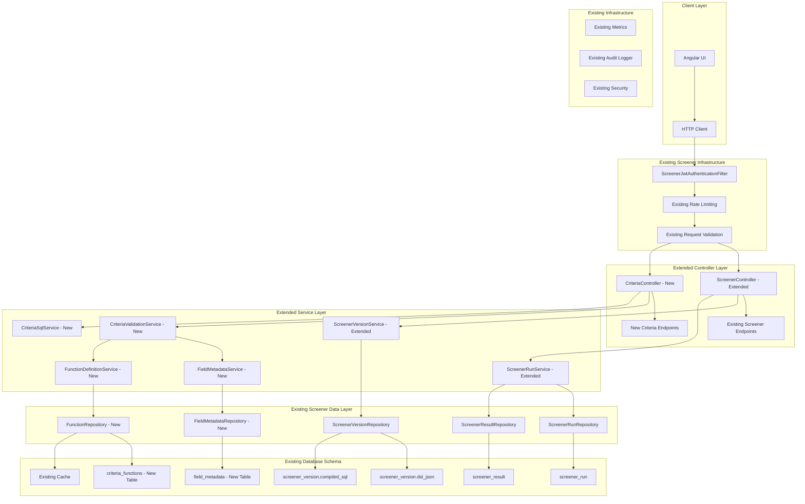
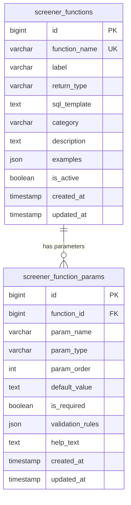

# Design Document - Criteria Builder API

## Overview

The Criteria Builder API extends the existing MoneyPlant screener package to provide secure backend support for the Criteria Builder UI Library. It leverages the existing screener infrastructure including ScreenerVersion.dsl_json for storing criteria DSL, compiled_sql for generated SQL, and the complete execution framework. The design adds new entities, services, and endpoints directly within the existing screener package structure, emphasizing security, performance, and seamless integration without creating unnecessary package complexity.

## Architecture

### High-Level Architecture



### Extended Package Structure

```
com.moneyplant.screener/
├── controllers/
│   ├── ScreenerController.java (existing - extended with criteria endpoints)
│   ├── ScreenerVersionController.java (existing - extended)
│   └── ScreenerRunController.java (existing - extended)
├── services/
│   ├── ScreenerVersionService.java (existing - extended)
│   ├── ScreenerRunService.java (existing - extended)
│   ├── CriteriaValidationService.java (new)
│   ├── CriteriaSqlService.java (new)
│   ├── FieldMetadataService.java (new)
│   └── FunctionDefinitionService.java (new)
├── repositories/
│   ├── ScreenerVersionRepository.java (existing)
│   ├── ScreenerRunRepository.java (existing)
│   ├── FieldMetadataRepository.java (new)
│   ├── ScreenerFunctionRepository.java (new)
│   └── ScreenerFunctionParamRepository.java (new)
├── entities/
│   ├── ScreenerVersion.java (existing - uses dsl_json field)
│   ├── ScreenerRun.java (existing)
│   ├── ScreenerResult.java (existing)
│   ├── FieldMetadata.java (new)
│   ├── ScreenerFunction.java (new)
│   └── ScreenerFunctionParam.java (new)
├── dtos/
│   ├── ScreenerVersionCreateReq.java (existing - extended)
│   ├── CriteriaValidationReq.java (new)
│   ├── CriteriaSqlReq.java (new)
│   ├── FieldMetaResp.java (new)
│   ├── FunctionMetaResp.java (new)
│   ├── CriteriaDSL.java (new)
│   ├── Group.java (new)
│   ├── Condition.java (new)
│   ├── Expression.java (new)
│   ├── ValidationResult.java (new)
│   ├── ValidationError.java (new)
│   ├── SqlGenerationResult.java (new)
│   └── SqlGenerationContext.java (new)
└── exceptions/
    ├── CriteriaValidationException.java (new)
    └── SqlGenerationException.java (new)
```

## Data Models

### Database Schema for Function Management

The criteria builder uses dedicated database tables to manage function definitions and their parameters, providing centralized and dynamic function management.

#### screener_functions Table

```sql
CREATE TABLE screener_functions (
    id BIGINT PRIMARY KEY AUTO_INCREMENT,
    function_name VARCHAR(100) NOT NULL UNIQUE,
    label VARCHAR(200) NOT NULL,
    return_type VARCHAR(50) NOT NULL,
    sql_template TEXT,
    category VARCHAR(100),
    description TEXT,
    examples JSON,
    is_active BOOLEAN DEFAULT TRUE,
    created_at TIMESTAMP DEFAULT CURRENT_TIMESTAMP,
    updated_at TIMESTAMP DEFAULT CURRENT_TIMESTAMP ON UPDATE CURRENT_TIMESTAMP,
    
    INDEX idx_function_name (function_name),
    INDEX idx_category (category),
    INDEX idx_is_active (is_active)
);
```

#### screener_function_params Table

```sql
CREATE TABLE screener_function_params (
    id BIGINT PRIMARY KEY AUTO_INCREMENT,
    function_id BIGINT NOT NULL,
    param_name VARCHAR(100) NOT NULL,
    param_type VARCHAR(50) NOT NULL,
    param_order INT NOT NULL,
    default_value TEXT,
    is_required BOOLEAN DEFAULT TRUE,
    validation_rules JSON,
    help_text TEXT,
    created_at TIMESTAMP DEFAULT CURRENT_TIMESTAMP,
    updated_at TIMESTAMP DEFAULT CURRENT_TIMESTAMP ON UPDATE CURRENT_TIMESTAMP,
    
    FOREIGN KEY (function_id) REFERENCES criteria_functions(id) ON DELETE CASCADE,
    INDEX idx_function_id (function_id),
    INDEX idx_param_order (function_id, param_order),
    UNIQUE KEY uk_function_param (function_id, param_name)
);
```

#### Entity Relationships



### JPA Entity Models

#### CriteriaFunction Entity

```java
@Entity
@Table(name = "criteria_functions")
@Data
@NoArgsConstructor
@AllArgsConstructor
@Builder
public class CriteriaFunction {
    
    @Id
    @GeneratedValue(strategy = GenerationType.IDENTITY)
    private Long id;
    
    @Column(name = "function_name", unique = true, nullable = false, length = 100)
    private String functionName;
    
    @Column(name = "label", nullable = false, length = 200)
    private String label;
    
    @Column(name = "return_type", nullable = false, length = 50)
    @Enumerated(EnumType.STRING)
    private FieldType returnType;
    
    @Column(name = "sql_template", columnDefinition = "TEXT")
    private String sqlTemplate;
    
    @Column(name = "category", length = 100)
    private String category;
    
    @Column(name = "description", columnDefinition = "TEXT")
    private String description;
    
    @Column(name = "examples", columnDefinition = "JSON")
    @Convert(converter = JsonConverter.class)
    private List<String> examples;
    
    @Column(name = "is_active")
    @Builder.Default
    private Boolean isActive = true;
    
    @OneToMany(mappedBy = "function", cascade = CascadeType.ALL, fetch = FetchType.LAZY)
    @OrderBy("paramOrder ASC")
    private List<CriteriaFunctionParam> parameters = new ArrayList<>();
    
    @CreationTimestamp
    @Column(name = "created_at")
    private LocalDateTime createdAt;
    
    @UpdateTimestamp
    @Column(name = "updated_at")
    private LocalDateTime updatedAt;
}
```

#### CriteriaFunctionParam Entity

```java
@Entity
@Table(name = "criteria_function_params")
@Data
@NoArgsConstructor
@AllArgsConstructor
@Builder
public class CriteriaFunctionParam {
    
    @Id
    @GeneratedValue(strategy = GenerationType.IDENTITY)
    private Long id;
    
    @ManyToOne(fetch = FetchType.LAZY)
    @JoinColumn(name = "function_id", nullable = false)
    private CriteriaFunction function;
    
    @Column(name = "param_name", nullable = false, length = 100)
    private String paramName;
    
    @Column(name = "param_type", nullable = false, length = 50)
    @Enumerated(EnumType.STRING)
    private FieldType paramType;
    
    @Column(name = "param_order", nullable = false)
    private Integer paramOrder;
    
    @Column(name = "default_value", columnDefinition = "TEXT")
    private String defaultValue;
    
    @Column(name = "is_required")
    @Builder.Default
    private Boolean isRequired = true;
    
    @Column(name = "validation_rules", columnDefinition = "JSON")
    @Convert(converter = JsonConverter.class)
    private Map<String, Object> validationRules;
    
    @Column(name = "help_text", columnDefinition = "TEXT")
    private String helpText;
    
    @CreationTimestamp
    @Column(name = "created_at")
    private LocalDateTime createdAt;
    
    @UpdateTimestamp
    @Column(name = "updated_at")
    private LocalDateTime updatedAt;
}
```

## Components and Interfaces

### Controller Layer

#### CriteriaController

**Purpose:** New REST API endpoints for criteria operations integrated with screener package

```java
@RestController
@RequestMapping("/api/screeners/criteria")
@RequiredArgsConstructor
@Slf4j
@Tag(name = "Criteria", description = "Criteria Builder operations")
public class CriteriaController {
    
    private final CriteriaValidationService validationService;
    private final CriteriaSqlService sqlService;
    private final FieldMetadataService fieldMetadataService;
    private final FunctionDefinitionService functionService;
    private final CurrentUserService currentUserService;
    
    @GetMapping("/fields")
    @Operation(summary = "Get available fields", description = "Gets field metadata available for criteria building")
    public ResponseEntity<List<FieldMetaResp>> getAvailableFields() {
        Long userId = currentUserService.getCurrentUserId();
        List<FieldMetaResp> fields = fieldMetadataService.getFieldsForUser(userId);
        return ResponseEntity.ok(fields);
    }
    
    @GetMapping("/functions")
    @Operation(summary = "Get available functions", description = "Gets function definitions available for criteria building")
    public ResponseEntity<List<FunctionMetaResp>> getAvailableFunctions() {
        Long userId = currentUserService.getCurrentUserId();
        List<FunctionMetaResp> functions = functionService.getFunctionsForUser(userId);
        return ResponseEntity.ok(functions);
    }
    
    @PostMapping("/validate")
    @Operation(summary = "Validate criteria DSL", description = "Validates criteria DSL structure and semantics")
    public ResponseEntity<ValidationResult> validateCriteria(
            @Valid @RequestBody CriteriaValidationReq request) {
        
        Long userId = currentUserService.getCurrentUserId();
        ValidationResult result = validationService.validateDSL(request.getDsl(), userId);
        return ResponseEntity.ok(result);
    }
    
    @PostMapping("/sql")
    @Operation(summary = "Generate SQL from DSL", description = "Generates parameterized SQL from validated criteria DSL")
    public ResponseEntity<SqlGenerationResult> generateSql(
            @Valid @RequestBody CriteriaSqlReq request) {
        
        Long userId = currentUserService.getCurrentUserId();
        
        // Re-validate DSL server-side
        ValidationResult validation = validationService.validateDSL(request.getDsl(), userId);
        if (!validation.isValid()) {
            throw new CriteriaValidationException("Invalid DSL", validation.getErrors());
        }
        
        SqlGenerationResult result = sqlService.generateSql(request.getDsl(), userId);
        return ResponseEntity.ok(result);
    }
    
    // Visual Interface Support Endpoints
    
    @GetMapping("/fields/{fieldId}/operators")
    @Operation(summary = "Get compatible operators for field", description = "Gets operators compatible with specific field type")
    public ResponseEntity<List<OperatorInfo>> getFieldOperators(@PathVariable String fieldId) {
        Long userId = currentUserService.getCurrentUserId();
        List<OperatorInfo> operators = fieldMetadataService.getCompatibleOperators(fieldId, userId);
        return ResponseEntity.ok(operators);
    }
    
    @GetMapping("/fields/{fieldId}/suggestions")
    @Operation(summary = "Get value suggestions for field", description = "Gets value suggestions for enum fields or fields with suggestions API")
    public ResponseEntity<List<ValueSuggestion>> getFieldSuggestions(
            @PathVariable String fieldId,
            @RequestParam(required = false) String query) {
        Long userId = currentUserService.getCurrentUserId();
        List<ValueSuggestion> suggestions = fieldMetadataService.getValueSuggestions(fieldId, query, userId);
        return ResponseEntity.ok(suggestions);
    }
    
    @PostMapping("/validate-partial")
    @Operation(summary = "Validate partial criteria", description = "Validates incomplete criteria DSL for real-time feedback")
    public ResponseEntity<PartialValidationResult> validatePartialCriteria(
            @Valid @RequestBody PartialCriteriaValidationReq request) {
        Long userId = currentUserService.getCurrentUserId();
        PartialValidationResult result = validationService.validatePartialDSL(request.getPartialDsl(), userId);
        return ResponseEntity.ok(result);
    }
    
    @GetMapping("/functions/{functionId}/signature")
    @Operation(summary = "Get function signature details", description = "Gets detailed parameter information for function dialog display")
    public ResponseEntity<FunctionSignature> getFunctionSignature(@PathVariable String functionId) {
        Long userId = currentUserService.getCurrentUserId();
        FunctionSignature signature = functionService.getFunctionSignature(functionId, userId);
        return ResponseEntity.ok(signature);
    }
    
    @PostMapping("/preview")
    @Operation(summary = "Preview criteria results", description = "Returns formatted preview text and estimated result count")
    public ResponseEntity<CriteriaPreview> previewCriteria(
            @Valid @RequestBody CriteriaPreviewReq request) {
        Long userId = currentUserService.getCurrentUserId();
        CriteriaPreview preview = validationService.previewCriteria(request.getDsl(), userId);
        return ResponseEntity.ok(preview);
    }
    
    @GetMapping("/operators")
    @Operation(summary = "Get all operators", description = "Gets all available operators with descriptions and compatibility info")
    public ResponseEntity<List<OperatorInfo>> getAllOperators() {
        List<OperatorInfo> operators = validationService.getAllOperators();
        return ResponseEntity.ok(operators);
    }
    
}
```

#### Extended ScreenerVersionController

**Purpose:** Extend existing screener version controller to support criteria DSL

```java
// Extension to existing ScreenerVersionController
@PostMapping("/{screenerId}/versions")
@Operation(summary = "Create screener version with criteria", description = "Creates a new screener version with criteria DSL")
public ResponseEntity<ScreenerVersionResp> createVersionWithCriteria(
        @PathVariable Long screenerId,
        @Valid @RequestBody ScreenerVersionCreateReq request) {
    
    Long userId = currentUserService.getCurrentUserId();
    
    // If request contains criteria DSL, validate and generate SQL
    if (request.getDslJson() != null) {
        CriteriaDSL dsl = objectMapper.convertValue(request.getDslJson(), CriteriaDSL.class);
        
        ValidationResult validation = criteriaValidationService.validateDSL(dsl, userId);
        if (!validation.isValid()) {
            throw new CriteriaValidationException("Invalid criteria DSL", validation.getErrors());
        }
        
        SqlGenerationResult sqlResult = criteriaSqlService.generateSql(dsl, userId);
        request.setCompiledSql(sqlResult.getSql());
        request.setParamsSchemaJson(sqlResult.getParameters());
    }
    
    ScreenerVersionResp response = screenerVersionService.createVersion(screenerId, request);
    return ResponseEntity.status(HttpStatus.CREATED).body(response);
}
```

### Repository Layer

#### CriteriaFunctionRepository

**Purpose:** Database access for function definitions with caching support

```java
@Repository
public interface CriteriaFunctionRepository extends JpaRepository<CriteriaFunction, Long> {
    
    Optional<CriteriaFunction> findByFunctionNameAndIsActiveTrue(String functionName);
    
    List<CriteriaFunction> findByIsActiveTrueOrderByCategory();
    
    List<CriteriaFunction> findByCategoryAndIsActiveTrueOrderByLabel(String category);
    
    @Query("SELECT DISTINCT f.category FROM CriteriaFunction f WHERE f.isActive = true ORDER BY f.category")
    List<String> findDistinctCategoriesByIsActiveTrue();
    
    @Modifying
    @Query("UPDATE CriteriaFunction f SET f.isActive = false WHERE f.id = :id")
    void deactivateFunction(@Param("id") Long id);
    
    boolean existsByFunctionNameAndIsActiveTrue(String functionName);
}
```

#### CriteriaFunctionParamRepository

**Purpose:** Database access for function parameters with ordering support

```java
@Repository
public interface CriteriaFunctionParamRepository extends JpaRepository<CriteriaFunctionParam, Long> {
    
    List<CriteriaFunctionParam> findByFunctionIdOrderByParamOrder(Long functionId);
    
    List<CriteriaFunctionParam> findByFunctionFunctionNameOrderByParamOrder(String functionName);
    
    @Query("SELECT p FROM CriteriaFunctionParam p WHERE p.function.functionName = :functionName AND p.function.isActive = true ORDER BY p.paramOrder")
    List<CriteriaFunctionParam> findActiveParametersByFunctionName(@Param("functionName") String functionName);
    
    void deleteByFunctionId(Long functionId);
}
```

### Service Layer

#### CriteriaValidationService

**Purpose:** Comprehensive DSL validation integrated with screener security

```java
@Service
@RequiredArgsConstructor
@Slf4j
@Transactional(readOnly = true)
public class CriteriaValidationService {
    
    private final FieldMetadataService fieldService;
    private final FunctionDefinitionService functionService;
    private final CurrentUserService currentUserService;
    
    public ValidationResult validateDSL(CriteriaDSL dsl, Long userId) {
        ValidationContext context = new ValidationContext(userId);
        List<ValidationError> errors = new ArrayList<>();
        List<ValidationWarning> warnings = new ArrayList<>();
        
        try {
            // Load user's available fields and functions
            List<FieldMetaResp> userFields = fieldService.getFieldsForUser(userId);
            List<FunctionMetaResp> userFunctions = functionService.getFunctionsForUser(userId);
            
            context.setAvailableFields(userFields);
            context.setAvailableFunctions(userFunctions);
            
            // Structure validation
            validateStructure(dsl, context, errors, warnings);
            
            // Semantic validation
            validateSemantics(dsl, context, errors, warnings);
            
            // Performance validation
            validatePerformance(dsl, context, warnings);
            
        } catch (Exception e) {
            log.error("Validation error for user {}: {}", userId, e.getMessage(), e);
            errors.add(new ValidationError("VALIDATION_ERROR", e.getMessage(), "$.root"));
        }
        
        return ValidationResult.builder()
            .valid(errors.isEmpty())
            .errors(errors)
            .warnings(warnings)
            .validatedAt(Instant.now())
            .validatedBy(userId.toString())
            .build();
    }
    
    private void validateStructure(CriteriaDSL dsl, ValidationContext context, 
                                 List<ValidationError> errors, List<ValidationWarning> warnings) {
        
        // Check depth limits
        int maxDepth = config.getMaxGroupDepth();
        validateGroupDepth(dsl.getRoot(), 0, maxDepth, errors, "$.root");
        
        // Check complexity limits
        int conditionCount = countConditions(dsl.getRoot());
        if (conditionCount > config.getMaxConditions()) {
            errors.add(new ValidationError("MAX_CONDITIONS_EXCEEDED", 
                "Too many conditions: " + conditionCount, "$.root"));
        }
        
        // Validate group structure
        validateGroup(dsl.getRoot(), context, errors, warnings, "$.root");
    }
    
    private void validateSemantics(CriteriaDSL dsl, ValidationContext context,
                                 List<ValidationError> errors, List<ValidationWarning> warnings) {
        
        // Load user's available fields and functions
        List<FieldMeta> userFields = fieldService.getFieldsForUser(context.getUserId());
        List<FunctionMeta> userFunctions = functionService.getFunctionsForUser(context.getUserId());
        
        context.setAvailableFields(userFields);
        context.setAvailableFunctions(userFunctions);
        
        // Validate all references
        validateReferences(dsl.getRoot(), context, errors, warnings, "$.root");
    }
    
    private void validateGroup(Group group, ValidationContext context,
                             List<ValidationError> errors, List<ValidationWarning> warnings, String path) {
        
        // Validate operator
        if (!Arrays.asList("AND", "OR", "NOT").contains(group.getOperator())) {
            errors.add(new ValidationError("INVALID_OPERATOR", 
                "Invalid group operator: " + group.getOperator(), path + ".operator"));
        }
        
        // NOT groups should have exactly one child
        if ("NOT".equals(group.getOperator()) && group.getChildren().size() != 1) {
            errors.add(new ValidationError("INVALID_NOT_GROUP", 
                "NOT groups must have exactly one child", path));
        }
        
        // Validate children
        for (int i = 0; i < group.getChildren().size(); i++) {
            Object child = group.getChildren().get(i);
            String childPath = path + ".children[" + i + "]";
            
            if (child instanceof Condition) {
                validateCondition((Condition) child, context, errors, warnings, childPath);
            } else if (child instanceof Group) {
                validateGroup((Group) child, context, errors, warnings, childPath);
            }
        }
    }
    
    private void validateCondition(Condition condition, ValidationContext context,
                                 List<ValidationError> errors, List<ValidationWarning> warnings, String path) {
        
        // Validate left side
        FieldType leftType = validateLeftSide(condition.getLeft(), context, errors, warnings, path + ".left");
        
        // Validate operator compatibility
        if (leftType != null) {
            validateOperatorCompatibility(condition.getOperator(), leftType, errors, path + ".operator");
        }
        
        // Validate right side if required
        if (requiresRightSide(condition.getOperator())) {
            validateRightSide(condition.getRight(), condition.getOperator(), leftType, 
                            context, errors, warnings, path + ".right");
        }
    }
}
```

#### CriteriaSqlService

**Purpose:** Safe SQL generation from validated DSL integrated with screener infrastructure

```java
@Service
@RequiredArgsConstructor
@Slf4j
public class CriteriaSqlService {
    
    private final FieldMetadataService fieldService;
    private final FunctionDefinitionService functionService;
    private final ObjectMapper objectMapper;
    
    public SqlGenerationResult generateSql(CriteriaDSL dsl, Long userId) {
        
        SqlGenerationContext context = new SqlGenerationContext(userId);
        loadUserContext(context);
        
        Map<String, Object> parameters = new HashMap<>();
        AtomicInteger paramCounter = new AtomicInteger(1);
        
        // Generate WHERE clause
        String whereClause = generateGroupSql(dsl.getRoot(), context, parameters, paramCounter);
        
        SqlGenerationResult result = SqlGenerationResult.builder()
            .sql(whereClause)
            .parameters(parameters)
            .generatedAt(Instant.now())
            .generatedBy(userId.toString())
            .dslHash(calculateDslHash(dsl))
            .build();
        
        log.info("Generated SQL for user {}: {} with {} parameters", userId, whereClause, parameters.size());
        
        return result;
    }
    
    private String generateGroupSql(Group group, SqlGenerationContext context,
                                  Map<String, Object> parameters, AtomicInteger paramCounter) {
        
        List<String> childSqls = new ArrayList<>();
        
        for (Object child : group.getChildren()) {
            if (child instanceof Condition) {
                String conditionSql = generateConditionSql((Condition) child, context, parameters, paramCounter);
                childSqls.add(conditionSql);
            } else if (child instanceof Group) {
                String groupSql = generateGroupSql((Group) child, context, parameters, paramCounter);
                childSqls.add("(" + groupSql + ")");
            }
        }
        
        String operator = group.getOperator();
        if ("NOT".equals(operator)) {
            return "NOT (" + childSqls.get(0) + ")";
        } else {
            return String.join(" " + operator + " ", childSqls);
        }
    }
    
    private String generateConditionSql(Condition condition, SqlGenerationContext context,
                                      Map<String, Object> parameters, AtomicInteger paramCounter) {
        
        // Generate left side SQL
        String leftSql = generateExpressionSql(condition.getLeft(), context, parameters, paramCounter);
        
        // Generate operator SQL
        String operatorSql = generateOperatorSql(condition.getOperator(), condition.getRight(), 
                                               context, parameters, paramCounter);
        
        return leftSql + " " + operatorSql;
    }
    
    private String generateExpressionSql(Object expression, SqlGenerationContext context,
                                       Map<String, Object> parameters, AtomicInteger paramCounter) {
        
        if (expression instanceof FieldRef) {
            FieldRef fieldRef = (FieldRef) expression;
            FieldMeta field = context.getField(fieldRef.getFieldId());
            
            if (field == null) {
                throw new SqlGenerationException("Unknown field: " + fieldRef.getFieldId());
            }
            
            // Return sanitized column name
            return sqlSecurity.sanitizeColumnName(field.getDbColumn());
            
        } else if (expression instanceof FunctionCall) {
            return generateFunctionSql((FunctionCall) expression, context, parameters, paramCounter);
            
        } else if (expression instanceof Literal) {
            Literal literal = (Literal) expression;
            String paramName = "p" + paramCounter.getAndIncrement();
            parameters.put(paramName, literal.getValue());
            return ":" + paramName;
        }
        
        throw new SqlGenerationException("Unknown expression type: " + expression.getClass());
    }
    
    private String generateFunctionSql(FunctionCall functionCall, SqlGenerationContext context,
                                     Map<String, Object> parameters, AtomicInteger paramCounter) {
        
        FunctionMeta function = context.getFunction(functionCall.getFunctionId());
        if (function == null) {
            throw new SqlGenerationException("Unknown function: " + functionCall.getFunctionId());
        }
        
        // Generate argument SQLs
        List<String> argSqls = new ArrayList<>();
        for (Object arg : functionCall.getArgs()) {
            String argSql = generateExpressionSql(arg, context, parameters, paramCounter);
            argSqls.add(argSql);
        }
        
        // Apply SQL template
        String sqlTemplate = function.getSqlTemplate();
        if (sqlTemplate == null) {
            // Default function call format
            return function.getId() + "(" + String.join(", ", argSqls) + ")";
        }
        
        // Replace template tokens
        String result = sqlTemplate;
        for (int i = 0; i < argSqls.size(); i++) {
            result = result.replace("{{arg" + i + "}}", argSqls.get(i));
        }
        
        return result;
    }
}
```

#### FieldMetadataService

**Purpose:** Enhanced field metadata service with visual interface support

```java
@Service
@RequiredArgsConstructor
@Slf4j
@Transactional(readOnly = true)
public class FieldMetadataService {
    
    private final FieldMetadataRepository fieldRepository;
    private final CurrentUserService currentUserService;
    private final CacheManager cacheManager;
    
    @Cacheable(value = "fieldMetadata", key = "#userId")
    public List<FieldMetaResp> getFieldsForUser(Long userId) {
        // Get fields based on user role and permissions
        List<FieldMetadata> fields = fieldRepository.findByUserRole(getUserRole(userId));
        return fields.stream()
            .map(this::toFieldMetaResp)
            .collect(Collectors.toList());
    }
    
    public List<OperatorInfo> getCompatibleOperators(String fieldId, Long userId) {
        FieldMetadata field = fieldRepository.findById(fieldId)
            .orElseThrow(() -> new ResourceNotFoundException("Field not found: " + fieldId));
        
        // Check user access to field
        validateFieldAccess(field, userId);
        
        return field.getAllowedOps().stream()
            .map(this::toOperatorInfo)
            .collect(Collectors.toList());
    }
    
    public List<ValueSuggestion> getValueSuggestions(String fieldId, String query, Long userId) {
        FieldMetadata field = fieldRepository.findById(fieldId)
            .orElseThrow(() -> new ResourceNotFoundException("Field not found: " + fieldId));
        
        validateFieldAccess(field, userId);
        
        if (field.getSuggestionsApi() != null) {
            // Call external API for suggestions
            return callSuggestionsApi(field.getSuggestionsApi(), query);
        } else if (field.getDataType() == FieldType.ENUM) {
            // Return predefined enum values
            return getEnumSuggestions(field, query);
        }
        
        return Collections.emptyList();
    }
    
    private OperatorInfo toOperatorInfo(Operator operator) {
        return OperatorInfo.builder()
            .id(operator.name())
            .label(operator.getDisplayName())
            .description(operator.getDescription())
            .requiresRightSide(operator.requiresRightSide())
            .supportedTypes(operator.getSupportedTypes())
            .build();
    }
}
```

#### FunctionDefinitionService

**Purpose:** Database-driven function service with visual interface support

```java
@Service
@RequiredArgsConstructor
@Slf4j
@Transactional(readOnly = true)
public class FunctionDefinitionService {
    
    private final CriteriaFunctionRepository functionRepository;
    private final CriteriaFunctionParamRepository paramRepository;
    private final CurrentUserService currentUserService;
    
    @Cacheable(value = "functionMetadata", key = "#userId")
    public List<FunctionMetaResp> getFunctionsForUser(Long userId) {
        List<CriteriaFunction> functions = functionRepository.findByIsActiveTrueOrderByCategory();
        return functions.stream()
            .filter(f -> hasAccessToFunction(f, userId))
            .map(this::toFunctionMetaResp)
            .collect(Collectors.toList());
    }
    
    public FunctionSignature getFunctionSignature(String functionName, Long userId) {
        CriteriaFunction function = functionRepository.findByFunctionNameAndIsActiveTrue(functionName)
            .orElseThrow(() -> new ResourceNotFoundException("Function not found: " + functionName));
        
        validateFunctionAccess(function, userId);
        
        return FunctionSignature.builder()
            .id(function.getFunctionName())
            .label(function.getLabel())
            .description(function.getDescription())
            .returnType(function.getReturnType())
            .parameters(function.getParameters().stream()
                .map(this::toParameterSignature)
                .collect(Collectors.toList()))
            .examples(function.getExamples())
            .category(function.getCategory())
            .sqlTemplate(function.getSqlTemplate())
            .build();
    }
    
    public FunctionMeta getFunctionMeta(String functionName, Long userId) {
        CriteriaFunction function = functionRepository.findByFunctionNameAndIsActiveTrue(functionName)
            .orElseThrow(() -> new ResourceNotFoundException("Function not found: " + functionName));
        
        validateFunctionAccess(function, userId);
        
        return FunctionMeta.builder()
            .id(function.getFunctionName())
            .label(function.getLabel())
            .returnType(function.getReturnType())
            .sqlTemplate(function.getSqlTemplate())
            .category(function.getCategory())
            .description(function.getDescription())
            .examples(function.getExamples())
            .params(function.getParameters().stream()
                .map(this::toFunctionParam)
                .collect(Collectors.toList()))
            .build();
    }
    
    @CacheEvict(value = "functionMetadata", allEntries = true)
    public void invalidateFunctionCache() {
        log.info("Function metadata cache invalidated");
    }
    
    private FunctionMetaResp toFunctionMetaResp(CriteriaFunction function) {
        return FunctionMetaResp.builder()
            .id(function.getFunctionName())
            .label(function.getLabel())
            .returnType(function.getReturnType())
            .category(function.getCategory())
            .description(function.getDescription())
            .examples(function.getExamples())
            .paramCount(function.getParameters().size())
            .build();
    }
    
    private ParameterSignature toParameterSignature(CriteriaFunctionParam param) {
        return ParameterSignature.builder()
            .name(param.getParamName())
            .type(param.getParamType())
            .order(param.getParamOrder())
            .required(param.getIsRequired())
            .defaultValue(param.getDefaultValue())
            .validationRules(param.getValidationRules())
            .helpText(param.getHelpText())
            .build();
    }
    
    private FunctionParam toFunctionParam(CriteriaFunctionParam param) {
        return FunctionParam.builder()
            .name(param.getParamName())
            .type(param.getParamType())
            .order(param.getParamOrder())
            .required(param.getIsRequired())
            .defaultValue(param.getDefaultValue())
            .constraints(param.getValidationRules())
            .build();
    }
    
    private boolean hasAccessToFunction(CriteriaFunction function, Long userId) {
        // Implement role-based function access control
        // For now, return true for all active functions
        return function.getIsActive();
    }
    
    private void validateFunctionAccess(CriteriaFunction function, Long userId) {
        if (!hasAccessToFunction(function, userId)) {
            throw new AccessDeniedException("Access denied to function: " + function.getFunctionName());
        }
    }
}
```

#### Enhanced CriteriaValidationService

**Purpose:** Extended validation service with partial validation and preview support

```java
// Additional methods for CriteriaValidationService

public PartialValidationResult validatePartialDSL(Object partialDsl, Long userId) {
    ValidationContext context = new ValidationContext(userId);
    loadUserContext(context);
    
    List<ValidationError> errors = new ArrayList<>();
    List<ValidationWarning> warnings = new ArrayList<>();
    List<ValidationSuggestion> suggestions = new ArrayList<>();
    
    try {
        // Validate what we can from partial DSL
        validatePartialStructure(partialDsl, context, errors, warnings, suggestions);
        
        return PartialValidationResult.builder()
            .valid(errors.isEmpty())
            .errors(errors)
            .warnings(warnings)
            .suggestions(suggestions)
            .validatedAt(Instant.now())
            .build();
            
    } catch (Exception e) {
        log.error("Partial validation error for user {}: {}", userId, e.getMessage(), e);
        errors.add(new ValidationError("PARTIAL_VALIDATION_ERROR", e.getMessage(), "$."));
        
        return PartialValidationResult.builder()
            .valid(false)
            .errors(errors)
            .validatedAt(Instant.now())
            .build();
    }
}

public CriteriaPreview previewCriteria(CriteriaDSL dsl, Long userId) {
    ValidationResult validation = validateDSL(dsl, userId);
    
    if (!validation.isValid()) {
        return CriteriaPreview.builder()
            .valid(false)
            .errors(validation.getErrors())
            .build();
    }
    
    try {
        // Generate human-readable description
        String description = generateHumanReadableDescription(dsl);
        
        // Estimate result count (optional - can be expensive)
        Long estimatedCount = estimateResultCount(dsl, userId);
        
        return CriteriaPreview.builder()
            .valid(true)
            .description(description)
            .estimatedResultCount(estimatedCount)
            .complexity(calculateComplexity(dsl))
            .estimatedExecutionTime(estimateExecutionTime(dsl))
            .build();
            
    } catch (Exception e) {
        log.error("Preview generation error for user {}: {}", userId, e.getMessage(), e);
        return CriteriaPreview.builder()
            .valid(false)
            .errors(List.of(new ValidationError("PREVIEW_ERROR", e.getMessage(), "$.root")))
            .build();
    }
}

public List<OperatorInfo> getAllOperators() {
    return Arrays.stream(Operator.values())
        .map(this::toOperatorInfo)
        .collect(Collectors.toList());
}
```

#### Extended ScreenerRunService

**Purpose:** Extend existing screener run service to support criteria execution

```java
// Extension to existing ScreenerRunService
@Service
@RequiredArgsConstructor
@Slf4j
@Transactional
public class ScreenerRunService {
    
    // Existing dependencies
    private final ScreenerRunRepository runRepository;
    private final ScreenerResultRepository resultRepository;
    private final ScreenerVersionRepository versionRepository;
    
    // New dependencies for criteria support
    private final CriteriaValidationService criteriaValidationService;
    private final CriteriaSqlService criteriaSqlService;
    
    // Extended method to handle criteria-based screener runs
    public RunResp createRunWithCriteria(Long screenerId, RunCreateReq request) {
        
        Long userId = currentUserService.getCurrentUserId();
        
        // Get screener version
        ScreenerVersion version = versionRepository.findById(request.getScreenerVersionId())
            .orElseThrow(() -> new ResourceNotFoundException("Screener version not found"));
        
        // If version contains criteria DSL, validate it
        if (version.getDslJson() != null) {
            CriteriaDSL dsl = objectMapper.convertValue(version.getDslJson(), CriteriaDSL.class);
            
            ValidationResult validation = criteriaValidationService.validateDSL(dsl, userId);
            if (!validation.isValid()) {
                throw new CriteriaValidationException("Invalid criteria in screener version", validation.getErrors());
            }
            
            // Ensure compiled SQL is up to date
            if (version.getCompiledSql() == null) {
                SqlGenerationResult sqlResult = criteriaSqlService.generateSql(dsl, userId);
                version.setCompiledSql(sqlResult.getSql());
                versionRepository.save(version);
            }
        }
        
        // Use existing screener run creation logic
        return createRun(screenerId, request);
    }
    
    private List<Map<String, Object>> executeWithTimeout(String sql, Map<String, Object> parameters) {
        
        return jdbcTemplate.execute((Connection connection) -> {
            try (PreparedStatement statement = connection.prepareStatement(sql)) {
                
                // Set query timeout
                statement.setQueryTimeout(30); // 30 seconds
                
                // Bind parameters
                int paramIndex = 1;
                for (Map.Entry<String, Object> param : parameters.entrySet()) {
                    statement.setObject(paramIndex++, param.getValue());
                }
                
                try (ResultSet resultSet = statement.executeQuery()) {
                    return extractResults(resultSet);
                }
            }
        });
    }
    
    public SavedCriteria saveCriteria(CriteriaDSL dsl, CriteriaMetadata metadata, String userId) {
        
        // Validate DSL
        ValidationResult validation = validationService.validateDSL(dsl, userId);
        if (!validation.isValid()) {
            throw new CriteriaValidationException("Cannot save invalid criteria", validation.getErrors());
        }
        
        SavedCriteria saved = SavedCriteria.builder()
            .id(UUID.randomUUID().toString())
            .userId(userId)
            .name(metadata.getName())
            .description(metadata.getDescription())
            .dsl(dsl)
            .tags(metadata.getTags())
            .createdAt(Instant.now())
            .updatedAt(Instant.now())
            .version(1)
            .build();
        
        executionRepository.saveCriteria(saved);
        auditService.logCriteriaSaved(userId, saved.getId(), metadata.getName());
        
        return saved;
    }
}
```

## Data Models

### New Entity Models

```java
@Entity
@Table(name = "field_metadata")
@Data
@Builder
@NoArgsConstructor
@AllArgsConstructor
public class FieldMetadata {
    
    @Id
    private String id;
    
    @Column(nullable = false)
    private String label;
    
    @Column(name = "db_column", nullable = false)
    private String dbColumn;
    
    @Enumerated(EnumType.STRING)
    @Column(name = "data_type", nullable = false)
    private FieldType dataType;
    
    @ElementCollection
    @Enumerated(EnumType.STRING)
    @CollectionTable(name = "field_allowed_operators")
    private Set<Operator> allowedOps;
    
    @Column(name = "suggestions_api")
    private String suggestionsApi;
    
    @Column(name = "example_value")
    private String example;
    
    @Column(nullable = false)
    @Builder.Default
    private Boolean nullable = false;
    
    @Column
    private String category;
    
    @Column(columnDefinition = "TEXT")
    private String description;
    
    @Column(name = "created_at", nullable = false, updatable = false)
    private OffsetDateTime createdAt;
    
    @Column(name = "updated_at", nullable = false)
    private OffsetDateTime updatedAt;
    
    @Column(name = "created_by")
    private String createdBy;
    
    @PrePersist
    protected void onCreate() {
        OffsetDateTime now = OffsetDateTime.now();
        createdAt = now;
        updatedAt = now;
    }
    
    @PreUpdate
    protected void onUpdate() {
        updatedAt = OffsetDateTime.now();
    }
}

@Entity
@Table(name = "function_metadata")
@Data
@Builder
@NoArgsConstructor
@AllArgsConstructor
public class FunctionMetadata {
    
    @Id
    private String id;
    
    @Column(nullable = false)
    private String label;
    
    @Enumerated(EnumType.STRING)
    @Column(name = "return_type", nullable = false)
    private FieldType returnType;
    
    @OneToMany(cascade = CascadeType.ALL, fetch = FetchType.EAGER)
    @JoinColumn(name = "function_id")
    private List<FunctionParameter> params;
    
    @Column(name = "sql_template", columnDefinition = "TEXT")
    private String sqlTemplate;
    
    @Column(columnDefinition = "TEXT")
    private String description;
    
    @Column
    private String category;
    
    @ElementCollection
    @CollectionTable(name = "function_examples")
    private List<String> examples;
    
    @Column
    @Builder.Default
    private Boolean deprecated = false;
    
    @Column
    private String version;
    
    @Column(name = "created_at", nullable = false, updatable = false)
    private OffsetDateTime createdAt;
    
    @Column(name = "updated_at", nullable = false)
    private OffsetDateTime updatedAt;
    
    @PrePersist
    protected void onCreate() {
        OffsetDateTime now = OffsetDateTime.now();
        createdAt = now;
        updatedAt = now;
    }
    
    @PreUpdate
    protected void onUpdate() {
        updatedAt = OffsetDateTime.now();
    }
}

### Extended Existing Entities

```java
// ScreenerVersion entity already exists with dsl_json field
// No new entity needed - criteria DSL is stored in existing ScreenerVersion.dsl_json

// Example of how criteria DSL integrates with existing ScreenerVersion:
@Entity
@Table(name = "screener_version")
public class ScreenerVersion {
    // ... existing fields ...
    
    @Column(name = "dsl_json", columnDefinition = "jsonb")
    @JdbcTypeCode(SqlTypes.JSON)
    private Object dslJson; // This will store CriteriaDSL when using criteria builder
    
    @Column(name = "compiled_sql", columnDefinition = "text")
    private String compiledSql; // Generated SQL from criteria DSL
    
    @Column(name = "params_schema_json", columnDefinition = "jsonb")
    @JdbcTypeCode(SqlTypes.JSON)
    private Object paramsSchemaJson; // Parameter definitions for the generated SQL
    
    // ... rest of existing fields ...
}
```

### DTO Models

```java
@Data
@Builder
@JsonInclude(JsonInclude.Include.NON_NULL)
public class ValidationResult {
    private boolean valid;
    private List<ValidationError> errors;
    private List<ValidationWarning> warnings;
    private Instant validatedAt;
    private String validatedBy;
    private Map<String, Object> metadata;
}

@Data
@Builder
public class SqlGenerationResult {
    private String sql;
    private Map<String, Object> parameters;
    private Instant generatedAt;
    private String generatedBy;
    private String dslHash;
    private List<String> referencedTables;
    private List<String> referencedColumns;
}

@Data
@Builder
public class CriteriaExecutionResult {
    private List<Map<String, Object>> results;
    private Long totalCount;
    private Duration executionTime;
    private PaginationRequest pagination;
    private boolean hasMore;
    private Map<String, Object> executionStats;
}

// Visual Interface Support DTOs

@Data
@Builder
@JsonInclude(JsonInclude.Include.NON_NULL)
public class FieldMetaResp {
    private String id;
    private String label;
    private String dbColumn;
    private FieldType dataType;
    private Set<Operator> allowedOps;
    private String suggestionsApi;
    private String example;
    private Boolean nullable;
    private String category;
    private String description;
    private Map<String, Object> validation;
}

@Data
@Builder
@JsonInclude(JsonInclude.Include.NON_NULL)
public class FunctionMetaResp {
    private String id;
    private String label;
    private FieldType returnType;
    private List<FunctionParameterResp> params;
    private String sqlTemplate;
    private String description;
    private String category;
    private List<String> examples;
    private Boolean deprecated;
    private String version;
}

@Data
@Builder
public class OperatorInfo {
    private String id;
    private String label;
    private String description;
    private Boolean requiresRightSide;
    private Set<FieldType> supportedTypes;
    private String symbol;
    private Integer precedence;
}

@Data
@Builder
public class ValueSuggestion {
    private Object value;
    private String label;
    private String description;
    private String category;
    private Boolean disabled;
}

@Data
@Builder
public class PartialValidationResult {
    private Boolean valid;
    private List<ValidationError> errors;
    private List<ValidationWarning> warnings;
    private List<ValidationSuggestion> suggestions;
    private Instant validatedAt;
    private Map<String, Object> context;
}

@Data
@Builder
public class ValidationSuggestion {
    private String type; // "field", "operator", "value", "function"
    private String message;
    private String path;
    private List<Object> suggestedValues;
    private String action; // "add", "replace", "complete"
}

@Data
@Builder
public class FunctionSignature {
    private String id;
    private String label;
    private String description;
    private FieldType returnType;
    private List<ParameterSignature> parameters;
    private List<String> examples;
    private String category;
    private Map<String, Object> metadata;
}

@Data
@Builder
public class ParameterSignature {
    private String name;
    private String label;
    private FieldType type;
    private Boolean required;
    private Object defaultValue;
    private String description;
    private Map<String, Object> constraints;
    private List<Object> allowedValues;
}

@Data
@Builder
public class CriteriaPreview {
    private Boolean valid;
    private String description;
    private Long estimatedResultCount;
    private String complexity; // "simple", "moderate", "complex"
    private Duration estimatedExecutionTime;
    private List<ValidationError> errors;
    private List<String> referencedFields;
    private List<String> referencedFunctions;
}

// Request DTOs

@Data
@Valid
public class PartialCriteriaValidationReq {
    @NotNull
    private Object partialDsl;
    private String context; // "field_selection", "operator_selection", "value_input", etc.
    private Map<String, Object> metadata;
}

@Data
@Valid
public class CriteriaPreviewReq {
    @NotNull
    private CriteriaDSL dsl;
    private Boolean includeEstimatedCount;
    private Boolean includeExecutionTime;
}
```

## Error Handling

### Exception Hierarchy

```java
@ResponseStatus(HttpStatus.BAD_REQUEST)
public class CriteriaValidationException extends RuntimeException {
    private final List<ValidationError> errors;
    
    public CriteriaValidationException(String message, List<ValidationError> errors) {
        super(message);
        this.errors = errors;
    }
}

@ResponseStatus(HttpStatus.INTERNAL_SERVER_ERROR)
public class SqlGenerationException extends RuntimeException {
    public SqlGenerationException(String message) {
        super(message);
    }
    
    public SqlGenerationException(String message, Throwable cause) {
        super(message, cause);
    }
}

@ResponseStatus(HttpStatus.FORBIDDEN)
public class SecurityViolationException extends RuntimeException {
    private final String violationType;
    private final String userId;
    
    public SecurityViolationException(String message, String violationType, String userId) {
        super(message);
        this.violationType = violationType;
        this.userId = userId;
    }
}
```

### Global Exception Handler

```java
@RestControllerAdvice
public class CriteriaExceptionHandler {
    
    private static final Logger logger = LoggerFactory.getLogger(CriteriaExceptionHandler.class);
    
    @ExceptionHandler(CriteriaValidationException.class)
    public ResponseEntity<ErrorResponse> handleValidationException(CriteriaValidationException e) {
        
        ErrorResponse response = ErrorResponse.builder()
            .error("VALIDATION_FAILED")
            .message(e.getMessage())
            .details(e.getErrors())
            .timestamp(Instant.now())
            .build();
            
        return ResponseEntity.badRequest().body(response);
    }
    
    @ExceptionHandler(SecurityViolationException.class)
    public ResponseEntity<ErrorResponse> handleSecurityViolation(SecurityViolationException e) {
        
        logger.warn("Security violation: {} by user: {}", e.getMessage(), e.getUserId());
        
        ErrorResponse response = ErrorResponse.builder()
            .error("SECURITY_VIOLATION")
            .message("Access denied")
            .timestamp(Instant.now())
            .build();
            
        return ResponseEntity.status(HttpStatus.FORBIDDEN).body(response);
    }
    
    @ExceptionHandler(SqlGenerationException.class)
    public ResponseEntity<ErrorResponse> handleSqlGenerationException(SqlGenerationException e) {
        
        logger.error("SQL generation failed", e);
        
        ErrorResponse response = ErrorResponse.builder()
            .error("SQL_GENERATION_FAILED")
            .message("Unable to generate SQL from criteria")
            .timestamp(Instant.now())
            .build();
            
        return ResponseEntity.status(HttpStatus.INTERNAL_SERVER_ERROR).body(response);
    }
}
```

## Testing Strategy

### Unit Testing

```java
@ExtendWith(MockitoExtension.class)
class CriteriaValidationServiceTest {
    
    @Mock
    private FieldMetadataService fieldService;
    
    @Mock
    private FunctionDefinitionService functionService;
    
    @Mock
    private SecurityValidationService securityService;
    
    @InjectMocks
    private CriteriaValidationService validationService;
    
    @Test
    void shouldValidateSimpleCriteria() {
        // Given
        CriteriaDSL dsl = createSimpleCriteria();
        when(fieldService.getFieldsForUser("user1")).thenReturn(createTestFields());
        
        // When
        ValidationResult result = validationService.validateDSL(dsl, "user1");
        
        // Then
        assertThat(result.isValid()).isTrue();
        assertThat(result.getErrors()).isEmpty();
    }
    
    @Test
    void shouldRejectInvalidFieldReference() {
        // Given
        CriteriaDSL dsl = createCriteriaWithInvalidField();
        when(fieldService.getFieldsForUser("user1")).thenReturn(createTestFields());
        
        // When
        ValidationResult result = validationService.validateDSL(dsl, "user1");
        
        // Then
        assertThat(result.isValid()).isFalse();
        assertThat(result.getErrors()).hasSize(1);
        assertThat(result.getErrors().get(0).getType()).isEqualTo("FIELD_NOT_FOUND");
    }
}

@ExtendWith(MockitoExtension.class)
class CriteriaSqlServiceTest {
    
    @Mock
    private FieldMetadataService fieldService;
    
    @Mock
    private FunctionDefinitionService functionService;
    
    @InjectMocks
    private CriteriaSqlService sqlService;
    
    @Test
    void shouldGenerateSimpleConditionSql() {
        // Given
        CriteriaDSL dsl = createSimpleCondition("price", ">", 100);
        when(fieldService.getFieldsForUser("user1")).thenReturn(createTestFields());
        
        // When
        SqlGenerationResult result = sqlService.generateSql(dsl, "user1");
        
        // Then
        assertThat(result.getSql()).isEqualTo("price > :p1");
        assertThat(result.getParameters()).containsEntry("p1", 100);
    }
    
    @Test
    void shouldGenerateFunctionCallSql() {
        // Given
        CriteriaDSL dsl = createFunctionCondition("RSI", Arrays.asList("close", 14), "<", 30);
        when(functionService.getFunctionsForUser("user1")).thenReturn(createTestFunctions());
        
        // When
        SqlGenerationResult result = sqlService.generateSql(dsl, "user1");
        
        // Then
        assertThat(result.getSql()).isEqualTo("rsi(close, :p1) < :p2");
        assertThat(result.getParameters()).containsEntry("p1", 14);
        assertThat(result.getParameters()).containsEntry("p2", 30);
    }
}
```

### Integration Testing

```java
@SpringBootTest
@TestPropertySource(properties = {
    "spring.datasource.url=jdbc:h2:mem:testdb",
    "spring.jpa.hibernate.ddl-auto=create-drop"
})
class CriteriaControllerIntegrationTest {
    
    @Autowired
    private TestRestTemplate restTemplate;
    
    @Autowired
    private FieldMetadataRepository fieldRepository;
    
    @Test
    @WithMockUser(username = "testuser", roles = "USER")
    void shouldExecuteCriteriaEndToEnd() {
        // Given
        setupTestData();
        CriteriaDSL dsl = createTestCriteria();
        
        // When
        ResponseEntity<CriteriaExecutionResult> response = restTemplate.postForEntity(
            "/api/criteria/execute",
            new CriteriaExecutionRequest(dsl, new PaginationRequest(0, 10)),
            CriteriaExecutionResult.class
        );
        
        // Then
        assertThat(response.getStatusCode()).isEqualTo(HttpStatus.OK);
        assertThat(response.getBody().getResults()).isNotEmpty();
        assertThat(response.getBody().getTotalCount()).isGreaterThan(0);
    }
}
```

This design provides a comprehensive, secure, and scalable backend API for the Criteria Builder system, with proper separation of concerns, extensive validation, and robust error handling.