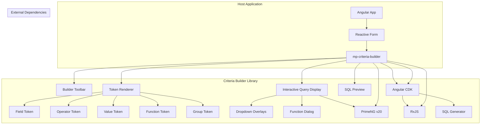
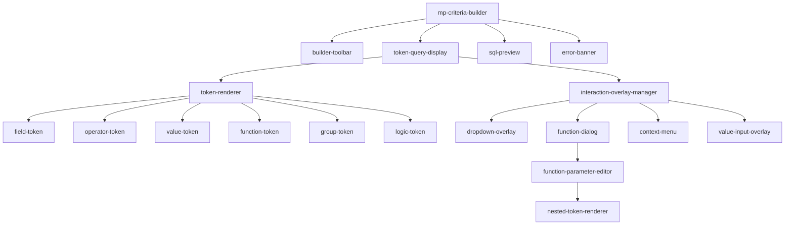

# Design Document - Criteria Builder UI Library

## Overview

The Criteria Builder UI Library is an Angular v20 library that provides a sophisticated visual form control for building complex filtering criteria through interactive tokens and clickable elements. The library implements a dynamic token-based interface where users compose queries by clicking on visual elements like dropdowns, dialogs, and interactive tokens. It generates both human-readable criteria sentences and safe parameterized SQL WHERE clauses. The design emphasizes visual clarity, intuitive interaction, type safety, security, accessibility, and seamless integration with Angular Reactive Forms.

## Architecture

### High-Level Architecture



### Component Hierarchy



## Visual Token System Design

### Token Types and Visual Representation

The interface uses a token-based system where each element of the query is represented as an interactive visual token:

```typescript
export interface TokenStyle {
  backgroundColor: string;
  borderColor: string;
  textColor: string;
  hoverColor: string;
  focusColor: string;
  errorColor: string;
}

export const TOKEN_STYLES: Record<TokenType, TokenStyle> = {
  field: {
    backgroundColor: '#e3f2fd',
    borderColor: '#2196f3',
    textColor: '#1976d2',
    hoverColor: '#bbdefb',
    focusColor: '#1976d2',
    errorColor: '#f44336'
  },
  operator: {
    backgroundColor: '#f5f5f5',
    borderColor: '#9e9e9e',
    textColor: '#424242',
    hoverColor: '#eeeeee',
    focusColor: '#757575',
    errorColor: '#f44336'
  },
  value: {
    backgroundColor: '#e8f5e8',
    borderColor: '#4caf50',
    textColor: '#2e7d32',
    hoverColor: '#c8e6c9',
    focusColor: '#388e3c',
    errorColor: '#f44336'
  },
  function: {
    backgroundColor: '#f3e5f5',
    borderColor: '#9c27b0',
    textColor: '#7b1fa2',
    hoverColor: '#e1bee7',
    focusColor: '#8e24aa',
    errorColor: '#f44336'
  },
  group: {
    backgroundColor: '#fff3e0',
    borderColor: '#ff9800',
    textColor: '#f57c00',
    hoverColor: '#ffe0b2',
    focusColor: '#fb8c00',
    errorColor: '#f44336'
  }
};
```

### Interactive Behavior Patterns

```typescript
export interface TokenInteraction {
  onClick: () => void;
  onDoubleClick?: () => void;
  onRightClick?: () => void;
  onHover?: () => void;
  onFocus?: () => void;
  onKeyDown?: (event: KeyboardEvent) => void;
  isDraggable: boolean;
  isDropTarget: boolean;
}

export interface OverlayConfig {
  type: 'dropdown' | 'dialog' | 'contextmenu' | 'inline';
  position: 'below' | 'above' | 'center' | 'right' | 'left';
  width?: string;
  height?: string;
  modal?: boolean;
  closeOnClickOutside?: boolean;
}
```

## API Integration

### CriteriaApiService

**Purpose:** Service for integrating with backend API for dynamic function and field management

```typescript
@Injectable({
  providedIn: 'root'
})
export class CriteriaApiService {
  
  constructor(private http: HttpClient) {}
  
  // Function Management API calls
  getFunctions(): Observable<FunctionMetaResp[]> {
    return this.http.get<FunctionMetaResp[]>('/api/screeners/criteria/functions');
  }
  
  getFunctionSignature(functionId: string): Observable<FunctionSignature> {
    return this.http.get<FunctionSignature>(`/api/screeners/criteria/functions/${functionId}/signature`);
  }
  
  // Field Management API calls
  getFields(): Observable<FieldMetaResp[]> {
    return this.http.get<FieldMetaResp[]>('/api/screeners/criteria/fields');
  }
  
  getFieldOperators(fieldId: string): Observable<OperatorInfo[]> {
    return this.http.get<OperatorInfo[]>(`/api/screeners/criteria/fields/${fieldId}/operators`);
  }
  
  getFieldSuggestions(fieldId: string, query?: string): Observable<ValueSuggestion[]> {
    const params = query ? { query } : {};
    return this.http.get<ValueSuggestion[]>(`/api/screeners/criteria/fields/${fieldId}/suggestions`, { params });
  }
  
  // Validation API calls
  validateCriteria(dsl: CriteriaDSL): Observable<ValidationResult> {
    return this.http.post<ValidationResult>('/api/screeners/criteria/validate', { dsl });
  }
  
  validatePartialCriteria(partialDsl: any): Observable<PartialValidationResult> {
    return this.http.post<PartialValidationResult>('/api/screeners/criteria/validate-partial', { partialDsl });
  }
  
  // SQL Generation API calls
  generateSql(dsl: CriteriaDSL): Observable<SqlGenerationResult> {
    return this.http.post<SqlGenerationResult>('/api/screeners/criteria/sql', { dsl });
  }
  
  // Preview API calls
  previewCriteria(dsl: CriteriaDSL): Observable<CriteriaPreview> {
    return this.http.post<CriteriaPreview>('/api/screeners/criteria/preview', { dsl });
  }
  
  // Utility API calls
  getAllOperators(): Observable<OperatorInfo[]> {
    return this.http.get<OperatorInfo[]>('/api/screeners/criteria/operators');
  }
}
```

### API Response Types

```typescript
export interface FunctionMetaResp {
  id: string;
  label: string;
  returnType: FieldType;
  category: string;
  description: string;
  examples: string[];
  paramCount: number;
}

export interface FunctionSignature {
  id: string;
  label: string;
  description: string;
  returnType: FieldType;
  parameters: ParameterSignature[];
  examples: string[];
  category: string;
  sqlTemplate?: string;
}

export interface ParameterSignature {
  name: string;
  type: FieldType;
  order: number;
  required: boolean;
  defaultValue?: string;
  validationRules?: Record<string, any>;
  helpText?: string;
}

export interface FieldMetaResp {
  id: string;
  label: string;
  dbColumn: string;
  dataType: FieldType;
  allowedOps?: Operator[];
  category?: string;
  description?: string;
  example?: string;
}

export interface OperatorInfo {
  id: string;
  label: string;
  description: string;
  requiresRightSide: boolean;
  supportedTypes: FieldType[];
}

export interface ValueSuggestion {
  label: string;
  value: any;
  description?: string;
}

export interface ValidationResult {
  isValid: boolean;
  errors: ValidationError[];
  warnings: ValidationWarning[];
}

export interface PartialValidationResult {
  isValid: boolean;
  errors: ValidationError[];
  warnings: ValidationWarning[];
  suggestions: ValidationSuggestion[];
}

export interface SqlGenerationResult {
  sql: string;
  parameters: Record<string, any>;
  generatedAt: string;
  generatedBy: string;
  dslHash: string;
}

export interface CriteriaPreview {
  valid: boolean;
  description?: string;
  estimatedResultCount?: number;
  complexity?: string;
  estimatedExecutionTime?: string;
  errors?: ValidationError[];
}
```

## Components and Interfaces

### Core Component: mp-criteria-builder

**Purpose:** Main container component implementing ControlValueAccessor

**Key Properties:**
```typescript
@Component({
  selector: 'mp-criteria-builder',
  template: `...`,
  providers: [
    {
      provide: NG_VALUE_ACCESSOR,
      useExisting: forwardRef(() => AcCriteriaBuilderComponent),
      multi: true
    }
  ]
})
export class AcCriteriaBuilderComponent implements ControlValueAccessor, OnInit, OnDestroy {
  @Input() config: BuilderConfig = {};
  
  @Output() validityChange = new EventEmitter<boolean>();
  @Output() sqlPreviewChange = new EventEmitter<{sql: string, params: Record<string, any>}>();
  
  // ControlValueAccessor implementation
  private onChange = (value: CriteriaDSL) => {};
  private onTouched = () => {};
  
  // Internal state
  currentDSL$ = new BehaviorSubject<CriteriaDSL | null>(null);
  isValid$ = new BehaviorSubject<boolean>(false);
  mode$ = new BehaviorSubject<'simple' | 'advanced'>('simple');
  
  // API-driven data
  fields$ = new BehaviorSubject<FieldMetaResp[]>([]);
  functions$ = new BehaviorSubject<FunctionMetaResp[]>([]);
  operators$ = new BehaviorSubject<OperatorInfo[]>([]);
  
  constructor(
    private criteriaApiService: CriteriaApiService,
    private cdr: ChangeDetectorRef
  ) {}
  
  ngOnInit() {
    this.loadMetadata();
    this.setupValidation();
  }
  
  private loadMetadata() {
    // Load fields from API
    this.criteriaApiService.getFields().subscribe({
      next: (fields) => this.fields$.next(fields),
      error: (error) => console.error('Failed to load fields:', error)
    });
    
    // Load functions from API
    this.criteriaApiService.getFunctions().subscribe({
      next: (functions) => this.functions$.next(functions),
      error: (error) => console.error('Failed to load functions:', error)
    });
    
    // Load operators from API
    this.criteriaApiService.getAllOperators().subscribe({
      next: (operators) => this.operators$.next(operators),
      error: (error) => console.error('Failed to load operators:', error)
    });
  }
}
```

**State Management:**
- Uses reactive forms with FormArray/FormGroup structure
- Maintains DSL state in BehaviorSubject for reactive updates
- Debounces changes (200ms) before emitting to parent form
- Validates entire DSL structure on each change

### Builder Toolbar Component

**Purpose:** Mode switching, import/export, and global actions

**Features:**
- Toggle between Simple and Advanced modes
- Import/Export JSON functionality
- Save/Load presets
- Clear all conditions
- SQL preview toggle

```typescript
@Component({
  selector: 'mp-builder-toolbar',
  template: `
    <div class="toolbar-container">
      <p-toggleButton 
        [(ngModel)]="isAdvancedMode" 
        onLabel="Advanced" 
        offLabel="Simple"
        (onChange)="onModeChange($event)">
      </p-toggleButton>
      
      <p-button 
        label="Import" 
        icon="pi pi-upload"
        (onClick)="onImport()">
      </p-button>
      
      <p-button 
        label="Export" 
        icon="pi pi-download"
        (onClick)="onExport()">
      </p-button>
    </div>
  `
})
export class BuilderToolbarComponent {
  @Input() currentDSL: CriteriaDSL | null = null;
  @Output() modeChange = new EventEmitter<'simple' | 'advanced'>();
  @Output() importDSL = new EventEmitter<CriteriaDSL>();
  @Output() exportDSL = new EventEmitter<void>();
}
```

### Token Query Display Component

**Purpose:** Renders the entire query as interactive visual tokens with proper spacing and grouping

**Features:**
- Token-based visual representation
- Click handlers for each token type
- Visual grouping with parentheses and indentation
- Drag-and-drop reordering
- Context menus and overlays

```typescript
@Component({
  selector: 'mp-token-query-display',
  template: `
    <div class="query-display-container" 
         [class.compact]="config.compactMode"
         cdkDropList 
         (cdkDropListDropped)="onTokenDrop($event)">
      
      <div class="query-tokens" 
           *ngFor="let token of tokenizedQuery; trackBy: trackByToken"
           [style.margin-left.px]="token.depth * 20">
        
        <mp-token-renderer 
          [token]="token"
          [isSelected]="isTokenSelected(token)"
          [hasError]="hasTokenError(token)"
          (tokenClick)="onTokenClick(token)"
          (tokenDoubleClick)="onTokenDoubleClick(token)"
          (tokenRightClick)="onTokenRightClick(token, $event)"
          cdkDrag
          [cdkDragData]="token">
        </mp-token-renderer>
        
        <span class="token-separator" *ngIf="needsSeparator(token)"></span>
      </div>
      
      <div class="add-condition-placeholder" 
           *ngIf="tokenizedQuery.length === 0"
           (click)="addFirstCondition()">
        <i class="pi pi-plus"></i>
        <span>Click to add condition</span>
      </div>
      
      <p-button 
        class="add-token-btn"
        icon="pi pi-plus"
        [style.display]="showAddButton ? 'inline-block' : 'none'"
        (onClick)="showAddTokenMenu($event)">
      </p-button>
    </div>
    
    <!-- Overlay Manager -->
    <mp-interaction-overlay-manager
      [activeOverlay]="activeOverlay"
      [overlayConfig]="overlayConfig"
      [targetToken]="selectedToken"
      (overlayClose)="onOverlayClose()"
      (overlayAction)="onOverlayAction($event)">
    </mp-interaction-overlay-manager>
  `
})
export class TokenQueryDisplayComponent {
  @Input() dsl: CriteriaDSL;
  @Input() fields: FieldMeta[] = [];
  @Input() functions: FunctionMeta[] = [];
  @Input() config: BuilderConfig = {};
  
  @Output() dslChange = new EventEmitter<CriteriaDSL>();
  @Output() tokenSelect = new EventEmitter<QueryToken>();
  
  tokenizedQuery: QueryToken[] = [];
  selectedToken: QueryToken | null = null;
  activeOverlay: OverlayType | null = null;
  overlayConfig: OverlayConfig = {};
}
```

### Token Renderer Component

**Purpose:** Renders individual tokens with appropriate styling and interaction handlers

**Features:**
- Dynamic styling based on token type
- Hover and focus states
- Error state visualization
- Click and keyboard interaction

```typescript
@Component({
  selector: 'mp-token-renderer',
  template: `
    <span class="token"
          [class]="getTokenClasses()"
          [style]="getTokenStyles()"
          [attr.tabindex]="0"
          [attr.role]="'button'"
          [attr.aria-label]="getAriaLabel()"
          (click)="onTokenClick()"
          (dblclick)="onTokenDoubleClick()"
          (contextmenu)="onTokenRightClick($event)"
          (keydown)="onTokenKeyDown($event)"
          (mouseenter)="onTokenHover()"
          (focus)="onTokenFocus()">
      
      <i class="token-icon" 
         [class]="getIconClass()" 
         *ngIf="token.icon">
      </i>
      
      <span class="token-text">{{ getDisplayText() }}</span>
      
      <i class="token-dropdown-indicator pi pi-chevron-down" 
         *ngIf="token.hasDropdown">
      </i>
      
      <i class="token-error-indicator pi pi-exclamation-triangle" 
         *ngIf="hasError">
      </i>
      
      <span class="token-delete" 
            *ngIf="token.isDeletable && (isSelected || isHovered)"
            (click)="onDeleteClick($event)">
        <i class="pi pi-times"></i>
      </span>
    </span>
  `,
  styleUrls: ['./token-renderer.component.scss']
})
export class TokenRendererComponent {
  @Input() token: QueryToken;
  @Input() isSelected: boolean = false;
  @Input() hasError: boolean = false;
  
  @Output() tokenClick = new EventEmitter<void>();
  @Output() tokenDoubleClick = new EventEmitter<void>();
  @Output() tokenRightClick = new EventEmitter<MouseEvent>();
  @Output() tokenDelete = new EventEmitter<void>();
  
  isHovered = false;
  isFocused = false;
}
```

### Value Editor Directive

**Purpose:** Dynamic component loader for different value types

**Strategy Pattern Implementation:**
```typescript
@Directive({
  selector: '[mpValueEditor]'
})
export class ValueEditorDirective implements OnInit, OnDestroy {
  @Input() valueType: FieldType;
  @Input() operator: Operator;
  @Input() value: any;
  @Input() fields: FieldMeta[] = [];
  @Input() functions: FunctionMeta[] = [];
  
  @Output() valueChange = new EventEmitter<any>();
  
  private componentRef: ComponentRef<any>;
  
  private editorComponents = {
    'number': NumericValueEditorComponent,
    'integer': IntegerValueEditorComponent,
    'string': StringValueEditorComponent,
    'date': DateValueEditorComponent,
    'boolean': BooleanValueEditorComponent,
    'enum': EnumValueEditorComponent,
    'percent': PercentValueEditorComponent,
    'currency': CurrencyValueEditorComponent
  };
  
  ngOnInit() {
    this.loadComponent();
  }
  
  private loadComponent() {
    const componentType = this.getComponentType();
    this.componentRef = this.viewContainer.createComponent(componentType);
    this.setupComponentInputs();
    this.setupComponentOutputs();
  }
}
```

### Interaction Overlay Manager Component

**Purpose:** Manages all overlay interactions (dropdowns, dialogs, context menus)

**Features:**
- Dynamic overlay positioning
- Multiple overlay types support
- Click-outside-to-close behavior
- Keyboard navigation support

```typescript
@Component({
  selector: 'mp-interaction-overlay-manager',
  template: `
    <!-- Dropdown Overlay -->
    <p-overlayPanel 
      #dropdownOverlay
      [showCloseIcon]="false"
      [dismissible]="true"
      (onHide)="onOverlayClose()">
      
      <mp-dropdown-content 
        *ngIf="activeOverlay === 'dropdown'"
        [overlayType]="overlayConfig.dropdownType"
        [options]="overlayConfig.options"
        [selectedValue]="overlayConfig.selectedValue"
        (optionSelect)="onDropdownSelect($event)">
      </mp-dropdown-content>
    </p-overlayPanel>
    
    <!-- Function Dialog -->
    <p-dialog 
      [(visible)]="showFunctionDialog"
      [modal]="true"
      [closable]="true"
      [resizable]="true"
      [width]="'600px'"
      header="Configure Function"
      (onHide)="onOverlayClose()">
      
      <mp-function-dialog-content
        [functions]="functions"
        [fields]="fields"
        [selectedFunction]="overlayConfig.selectedFunction"
        (functionConfirm)="onFunctionConfirm($event)"
        (functionCancel)="onOverlayClose()">
      </mp-function-dialog-content>
    </p-dialog>
    
    <!-- Context Menu -->
    <p-contextMenu 
      #contextMenu
      [model]="contextMenuItems"
      (onHide)="onOverlayClose()">
    </p-contextMenu>
    
    <!-- Value Input Overlay -->
    <p-overlayPanel 
      #valueInputOverlay
      [showCloseIcon]="false"
      [dismissible]="true"
      (onHide)="onOverlayClose()">
      
      <mp-value-input-content
        *ngIf="activeOverlay === 'valueInput'"
        [valueType]="overlayConfig.valueType"
        [currentValue]="overlayConfig.currentValue"
        [operator]="overlayConfig.operator"
        [fieldMeta]="overlayConfig.fieldMeta"
        (valueConfirm)="onValueConfirm($event)"
        (valueCancel)="onOverlayClose()">
      </mp-value-input-content>
    </p-overlayPanel>
  `
})
export class InteractionOverlayManagerComponent {
  @Input() activeOverlay: OverlayType | null = null;
  @Input() overlayConfig: OverlayConfig = {};
  @Input() targetToken: QueryToken | null = null;
  @Input() fields: FieldMeta[] = [];
  @Input() functions: FunctionMeta[] = [];
  
  @Output() overlayClose = new EventEmitter<void>();
  @Output() overlayAction = new EventEmitter<OverlayAction>();
  
  @ViewChild('dropdownOverlay') dropdownOverlay: OverlayPanel;
  @ViewChild('contextMenu') contextMenu: ContextMenu;
  @ViewChild('valueInputOverlay') valueInputOverlay: OverlayPanel;
  
  showFunctionDialog = false;
  contextMenuItems: MenuItem[] = [];
}
```

## Data Models

### Token System Types

```typescript
export type TokenType = 'field' | 'operator' | 'value' | 'function' | 'group' | 'logic' | 'parenthesis';

export interface QueryToken {
  id: string;
  type: TokenType;
  displayText: string;
  value: any;
  depth: number;
  position: number;
  isEditable: boolean;
  isDeletable: boolean;
  hasDropdown: boolean;
  hasDialog: boolean;
  icon?: string;
  tooltip?: string;
  errorMessage?: string;
  metadata?: Record<string, any>;
}

export interface OverlayAction {
  type: 'select' | 'confirm' | 'cancel' | 'delete' | 'edit';
  payload: any;
  targetToken: QueryToken;
}

export type OverlayType = 'dropdown' | 'dialog' | 'contextmenu' | 'valueInput';

export interface DropdownOption {
  label: string;
  value: any;
  icon?: string;
  disabled?: boolean;
  category?: string;
  description?: string;
}
```

### Core DSL Types

```typescript
// Enhanced type definitions with validation metadata
export interface CriteriaDSL {
  root: Group;
  meta?: {
    name?: string;
    description?: string;
    version?: number;
    createdBy?: string;
    createdAt?: string;
    tags?: string[];
  };
  validation?: {
    isValid: boolean;
    errors: ValidationError[];
    warnings: ValidationWarning[];
  };
}

export interface ValidationError {
  id: string;
  type: 'field_not_found' | 'function_not_found' | 'type_mismatch' | 'operator_incompatible' | 'required_parameter_missing';
  message: string;
  path: string; // JSONPath to the problematic element
  severity: 'error' | 'warning';
}

export interface BuilderConfig {
  allowGrouping?: boolean;
  maxDepth?: number;
  enableAdvancedFunctions?: boolean;
  autoSave?: boolean;
  locale?: string;
  theme?: 'light' | 'dark';
  compactMode?: boolean;
  showSqlPreview?: boolean;
  debounceMs?: number;
}
```

### Field and Function Metadata

```typescript
export interface FieldMeta {
  id: string;
  label: string;
  dbColumn: string;
  dataType: FieldType;
  allowedOps?: Operator[];
  suggestionsApi?: string;
  formatter?: (value: any) => string;
  parser?: (input: string) => any;
  example?: string;
  nullable?: boolean;
  category?: string;
  description?: string;
  validation?: {
    min?: number;
    max?: number;
    pattern?: string;
    required?: boolean;
  };
}

export interface FunctionMeta {
  id: string;
  label: string;
  returnType: FieldType;
  params: FunctionParam[];
  sqlTemplate?: string;
  description?: string;
  category?: string;
  examples?: string[];
  deprecated?: boolean;
  version?: string;
}
```

## Error Handling

### Validation Strategy

```typescript
@Injectable()
export class CriteriaValidatorService {
  validateDSL(dsl: CriteriaDSL, fields: FieldMeta[], functions: FunctionMeta[]): ValidationResult {
    const errors: ValidationError[] = [];
    const warnings: ValidationWarning[] = [];
    
    // Validate structure
    this.validateGroup(dsl.root, fields, functions, errors, warnings, '$.root');
    
    // Check depth limits
    this.validateDepth(dsl.root, errors, 0, 5);
    
    // Validate complexity
    this.validateComplexity(dsl, errors);
    
    return {
      isValid: errors.length === 0,
      errors,
      warnings
    };
  }
  
  private validateGroup(group: Group, fields: FieldMeta[], functions: FunctionMeta[], 
                       errors: ValidationError[], warnings: ValidationWarning[], path: string) {
    // Validate group operator
    if (!['AND', 'OR', 'NOT'].includes(group.operator)) {
      errors.push({
        id: generateId(),
        type: 'invalid_operator',
        message: `Invalid group operator: ${group.operator}`,
        path: `${path}.operator`,
        severity: 'error'
      });
    }
    
    // Validate children
    group.children.forEach((child, index) => {
      const childPath = `${path}.children[${index}]`;
      if (this.isCondition(child)) {
        this.validateCondition(child, fields, functions, errors, warnings, childPath);
      } else {
        this.validateGroup(child, fields, functions, errors, warnings, childPath);
      }
    });
  }
}
```

### Error Display Strategy

```typescript
@Component({
  selector: 'mp-error-banner',
  template: `
    <div class="error-banner" *ngIf="errors.length > 0">
      <p-messages [value]="errorMessages" [closable]="false"></p-messages>
      
      <div class="error-details" *ngIf="showDetails">
        <div class="error-item" *ngFor="let error of errors">
          <span class="error-path">{{ error.path }}</span>
          <span class="error-message">{{ error.message }}</span>
          <p-button 
            icon="pi pi-search" 
            size="small"
            (onClick)="highlightError(error)">
          </p-button>
        </div>
      </div>
      
      <p-button 
        [label]="showDetails ? 'Hide Details' : 'Show Details'"
        (onClick)="toggleDetails()">
      </p-button>
    </div>
  `
})
export class ErrorBannerComponent {
  @Input() errors: ValidationError[] = [];
  @Output() highlightError = new EventEmitter<ValidationError>();
  
  showDetails = false;
  
  get errorMessages(): Message[] {
    return this.errors.map(error => ({
      severity: error.severity,
      summary: error.type.replace('_', ' ').toUpperCase(),
      detail: error.message
    }));
  }
}
```

## Testing Strategy

### Unit Testing Approach

```typescript
describe('AcCriteriaBuilderComponent', () => {
  let component: AcCriteriaBuilderComponent;
  let fixture: ComponentFixture<AcCriteriaBuilderComponent>;
  let serializerService: jasmine.SpyObj<CriteriaSerializerService>;
  
  beforeEach(() => {
    const spy = jasmine.createSpyObj('CriteriaSerializerService', ['validateDSL', 'generateSQL']);
    
    TestBed.configureTestingModule({
      declarations: [AcCriteriaBuilderComponent],
      imports: [ReactiveFormsModule, PrimeNGModule],
      providers: [
        { provide: CriteriaSerializerService, useValue: spy }
      ]
    });
    
    fixture = TestBed.createComponent(AcCriteriaBuilderComponent);
    component = fixture.componentInstance;
    serializerService = TestBed.inject(CriteriaSerializerService) as jasmine.SpyObj<CriteriaSerializerService>;
  });
  
  describe('ControlValueAccessor', () => {
    it('should implement writeValue correctly', () => {
      const dsl: CriteriaDSL = createTestDSL();
      component.writeValue(dsl);
      expect(component.currentDSL$.value).toEqual(dsl);
    });
    
    it('should call onChange when DSL changes', fakeAsync(() => {
      const onChange = jasmine.createSpy('onChange');
      component.registerOnChange(onChange);
      
      component.addCondition();
      tick(200); // debounce time
      
      expect(onChange).toHaveBeenCalled();
    }));
  });
  
  describe('Validation', () => {
    it('should validate DSL and emit validity changes', () => {
      serializerService.validateDSL.and.returnValue({ isValid: false, errors: [], warnings: [] });
      
      const validityChangeSpy = spyOn(component.validityChange, 'emit');
      component.validateCurrentDSL();
      
      expect(validityChangeSpy).toHaveBeenCalledWith(false);
    });
  });
});
```

### Integration Testing

```typescript
describe('Criteria Builder Integration', () => {
  it('should build complete DSL from UI interactions', async () => {
    const harness = await TestbedHarnessEnvironment.create(AcCriteriaBuilderComponent);
    const builderHarness = await harness.getHarness(CriteriaBuilderHarness);
    
    // Add first condition
    await builderHarness.addCondition();
    await builderHarness.selectField(0, 'price');
    await builderHarness.selectOperator(0, '>');
    await builderHarness.enterValue(0, '100');
    
    // Add group with OR condition
    await builderHarness.addGroup();
    await builderHarness.setGroupOperator(1, 'OR');
    await builderHarness.addConditionToGroup(1);
    
    const dsl = await builderHarness.getCurrentDSL();
    expect(dsl.root.children).toHaveLength(2);
    expect(dsl.root.children[0]).toEqual(jasmine.objectContaining({
      left: { fieldId: 'price' },
      op: '>',
      right: { type: 'number', value: 100 }
    }));
  });
});
```

This design provides a comprehensive foundation for implementing the Criteria Builder UI Library with proper separation of concerns, type safety, and extensive testing coverage. The architecture supports both simple and advanced use cases while maintaining security and performance requirements.