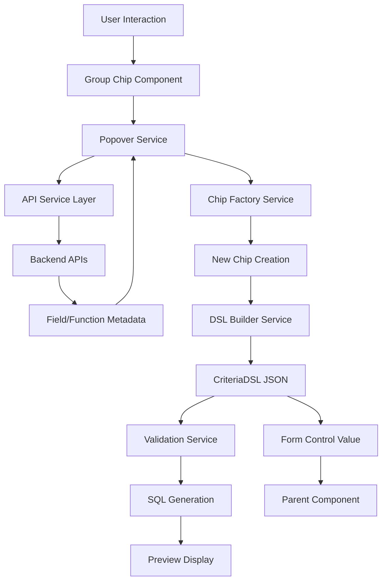

# Design Document

## Overview

The Criteria Builder Interface is a sophisticated Angular component that provides a visual query builder system for the MoneyPlant screener application. The component implements a nested group-chip architecture where users can dynamically compose complex conditional expressions through intuitive click-based interactions. The visual expressions are automatically converted to CriteriaDSL JSON format and processed by the backend SQL engine for data filtering.

### Key Design Principles

- **Visual-First Approach**: All query building is done through visual interactions, eliminating the need for manual SQL/DSL writing
- **Nested Group-Chip Architecture**: Hierarchical chip structure that mirrors the logical structure of complex queries
- **Progressive Disclosure**: Users start with simple chips and progressively build complexity through popovers
- **Real-time Feedback**: Immediate validation and SQL preview as users build their queries
- **Seamless Integration**: Fits naturally into existing MoneyPlant architecture and design patterns

## Architecture

### Component Hierarchy

```
mp-criteria-builder (Root Component)
├── mp-criteria-container (Main Container)
│   ├── mp-group-chip (Nestable Group Chips)
│   │   ├── mp-condition-chip (Individual Condition Elements)
│   │   ├── mp-function-chip (Function Elements)
│   │   ├── mp-parameter-chip (Function Parameters)
│   │   └── mp-add-chip (Plus Icon for Adding)
│   └── mp-criteria-popover (Multi-tab Configuration)
│       ├── fields-tab (Field Selection)
│       ├── operators-tab (Operator Selection)
│       ├── functions-tab (Math Functions)
│       └── indicators-tab (Technical Indicators)
├── mp-criteria-preview (SQL Preview Panel)
└── mp-criteria-validation (Validation Display)
```

### Data Flow Architecture



### State Management

The component uses a reactive state management approach with RxJS:

- **Criteria State**: Maintains the current CriteriaDSL structure
- **UI State**: Tracks active popovers, selected chips, validation states
- **Metadata State**: Caches field and function metadata from APIs
- **Validation State**: Real-time validation results and error states

## Components and Interfaces

### Core Component: mp-criteria-builder

**Purpose**: Root component implementing ControlValueAccessor for form integration

**Key Interfaces**:
```typescript
interface CriteriaBuilderConfig {
  maxDepth: number;
  maxElements: number;
  compactMode: boolean;
  enableDragDrop: boolean;
  showSqlPreview: boolean;
  validationMode: 'realtime' | 'onchange' | 'manual';
}

interface CriteriaBuilderState {
  dsl: CriteriaDSL;
  activePopover: string | null;
  selectedChip: string | null;
  validationResult: ValidationResult;
  isLoading: boolean;
  error: string | null;
}
```

**Public API**:
```typescript
@Component({
  selector: 'mp-criteria-builder',
  providers: [
    {
      provide: NG_VALUE_ACCESSOR,
      useExisting: forwardRef(() => CriteriaBuilderComponent),
      multi: true
    }
  ]
})
export class CriteriaBuilderComponent implements ControlValueAccessor, OnInit, OnDestroy {
  @Input() config: CriteriaBuilderConfig;
  @Input() fieldMetadata: FieldMetaResp[];
  @Input() functionMetadata: FunctionMetaResp[];
  @Input() disabled: boolean;
  
  @Output() dslChange = new EventEmitter<CriteriaDSL>();
  @Output() validationChange = new EventEmitter<ValidationResult>();
  @Output() sqlPreviewChange = new EventEmitter<SqlGenerationResult>();
}
```

### Group Chip Component: mp-group-chip

**Purpose**: Nestable container for criteria elements with logical operators

**Key Features**:
- Curly braces '{}' icon for grouping toggle
- Encircled plus '+' icon for adding sibling chips
- Drag-and-drop support for reordering
- Visual hierarchy with indentation
- Logical operator selection (AND/OR/NOT)

**Interface**:
```typescript
interface GroupChipData {
  id: string;
  operator: 'AND' | 'OR' | 'NOT';
  children: (GroupChipData | ConditionChipData | FunctionChipData)[];
  isGrouped: boolean;
  depth: number;
  parentId?: string;
}
```

### Condition Chip Component: mp-condition-chip

**Purpose**: Individual condition elements (field, operator, value)

**Key Features**:
- Field reference display with badges
- Operator display with appropriate icons
- Value display with type indicators
- Click-to-edit functionality
- Delete action with undo support

### Function Chip Component: mp-function-chip

**Purpose**: Function calls with parameter management

**Key Features**:
- Function name display with category badge
- Parameter placeholder chips
- Nested function support
- Parameter validation indicators
- Expandable parameter view

### Popover Component: mp-criteria-popover

**Purpose**: Multi-tab configuration interface

**Tabs Structure**:
1. **Fields Tab**: Field selection from metadata API
2. **Operators Tab**: Compatible operators based on field type
3. **Math Functions Tab**: Mathematical functions (AVG, SUM, etc.)
4. **Indicators Tab**: Technical analysis functions (SMA, EMA, etc.)

**Interface**:
```typescript
interface PopoverContext {
  chipId: string;
  chipType: 'group' | 'condition' | 'function' | 'parameter';
  currentValue: any;
  availableOptions: any[];
  validationRules: any;
}
```

## Data Models

### CriteriaDSL Structure

The component works with the existing backend CriteriaDSL structure:

```typescript
interface CriteriaDSL {
  root: Group;
  version: string;
  metadata?: any;
}

interface Group {
  operator: 'AND' | 'OR' | 'NOT';
  children: (Group | Condition)[];
  id?: string;
}

interface Condition {
  left: FieldRef | FunctionCall;
  operator: string;
  right?: Literal | FieldRef | FunctionCall;
  id?: string;
}
```

### UI-Specific Models

```typescript
interface ChipViewModel {
  id: string;
  type: 'group' | 'field' | 'operator' | 'value' | 'function' | 'parameter';
  displayText: string;
  badges: ChipBadge[];
  isEditable: boolean;
  isValid: boolean;
  validationMessage?: string;
  depth: number;
  parentId?: string;
}

interface ChipBadge {
  text: string;
  type: 'info' | 'warning' | 'error' | 'success';
  position: 'superscript' | 'subscript' | 'inline';
}
```

## Error Handling

### Validation Strategy

1. **Real-time Validation**: As users build criteria, validate structure and semantics
2. **Progressive Validation**: Validate partial structures during construction
3. **Server-side Validation**: Final validation before SQL generation
4. **User-friendly Messages**: Clear error messages with suggested fixes

### Error Types

- **Structural Errors**: Invalid nesting, missing operators, incomplete conditions
- **Semantic Errors**: Invalid field references, incompatible operators, type mismatches
- **API Errors**: Network failures, authentication issues, server errors
- **Validation Errors**: Business rule violations, constraint failures

### Error Display

```typescript
interface ValidationError {
  chipId: string;
  type: 'error' | 'warning' | 'info';
  message: string;
  suggestion?: string;
  canAutoFix: boolean;
}
```

Errors are displayed:
- As badges on affected chips
- In tooltips on hover
- In a validation panel (optional)
- Through toast notifications for critical errors

## Testing Strategy

### Unit Testing

- **Component Testing**: Each chip component tested in isolation
- **Service Testing**: API services, validation services, DSL builder services
- **Pipe Testing**: Display formatters, validation pipes
- **Utility Testing**: Helper functions, data transformers

### Integration Testing

- **Form Integration**: ControlValueAccessor implementation
- **API Integration**: Backend service integration
- **Component Interaction**: Chip-to-chip communication, popover interactions
- **State Management**: RxJS state flows, error handling

### E2E Testing

- **User Workflows**: Complete criteria building scenarios
- **Complex Scenarios**: Nested groups, function parameters, drag-and-drop
- **Error Scenarios**: Validation failures, API errors, recovery flows
- **Accessibility**: Keyboard navigation, screen reader support

### Visual Testing

- **Component Snapshots**: Visual regression testing for chip layouts
- **Responsive Testing**: Different screen sizes and orientations
- **Theme Testing**: Light/dark themes, custom styling
- **Browser Testing**: Cross-browser compatibility

## Performance Considerations

### Optimization Strategies

1. **Virtual Scrolling**: For large criteria structures
2. **Lazy Loading**: Load function metadata on demand
3. **Debounced Validation**: Prevent excessive API calls
4. **Memoization**: Cache validation results and SQL generation
5. **OnPush Strategy**: Optimize change detection

### Memory Management

- **Subscription Cleanup**: Proper RxJS subscription management
- **Component Lifecycle**: Clean disposal of resources
- **Cache Management**: LRU cache for metadata and validation results
- **Event Listener Cleanup**: Remove DOM event listeners

### Bundle Size

- **Tree Shaking**: Ensure unused code is eliminated
- **Lazy Loading**: Load popover components on demand
- **Shared Dependencies**: Leverage existing PrimeNG components
- **Code Splitting**: Separate validation and SQL generation logic

## Accessibility

### WCAG 2.1 AA Compliance

- **Keyboard Navigation**: Full keyboard support for all interactions
- **Screen Reader Support**: Proper ARIA labels and descriptions
- **Focus Management**: Logical tab order and focus indicators
- **Color Contrast**: Sufficient contrast ratios for all text and icons
- **Alternative Text**: Descriptive text for icons and visual elements

### Accessibility Features

```typescript
interface AccessibilityConfig {
  announceChanges: boolean;
  keyboardShortcuts: boolean;
  highContrastMode: boolean;
  reducedMotion: boolean;
  screenReaderOptimized: boolean;
}
```

### ARIA Implementation

- **Role Attributes**: Proper roles for interactive elements
- **State Attributes**: aria-expanded, aria-selected, aria-invalid
- **Property Attributes**: aria-label, aria-describedby, aria-owns
- **Live Regions**: Announce dynamic content changes

## Security Considerations

### Input Validation

- **Client-side Validation**: Prevent malicious input at UI level
- **Server-side Validation**: Final validation on backend
- **SQL Injection Prevention**: Parameterized queries only
- **XSS Prevention**: Sanitize all user inputs

### API Security

- **Authentication**: Use existing JWT token system
- **Authorization**: Respect user permissions for fields/functions
- **Rate Limiting**: Prevent abuse of validation APIs
- **HTTPS Only**: Secure communication channels

## Integration Points

### Backend Integration

The component integrates with existing backend endpoints:

- `GET /api/screeners/fields` - Field metadata
- `GET /api/screeners/functions` - Function metadata
- `GET /api/screeners/fields/{fieldId}/operators` - Compatible operators
- `POST /api/screeners/validate-criteria` - Validation
- `POST /api/screeners/generate-sql` - SQL generation
- `POST /api/screeners/preview-criteria` - Human-readable preview

### Frontend Integration

- **ScreenerApiService**: Use existing API service layer
- **ToastService**: Error and success notifications
- **LoadingService**: Loading state management
- **ThemeService**: Consistent styling and theming
- **AuthService**: User authentication and permissions

### Form Integration

```typescript
// Usage in screeners-configure.component.ts
export class ScreenersConfigureComponent {
  criteriaForm = this.fb.group({
    criteria: [null, [Validators.required, this.criteriaValidator]]
  });

  private criteriaValidator(control: AbstractControl): ValidationErrors | null {
    const criteria = control.value as CriteriaDSL;
    if (!criteria || !criteria.root || !criteria.root.children.length) {
      return { required: true };
    }
    return null;
  }
}
```

```html
<!-- Usage in screeners-configure.component.html -->
<div class="criteria-builder-container">
  <mp-criteria-builder
    formControlName="criteria"
    [config]="criteriaConfig"
    [disabled]="!isEditingBasicInfo"
    (validationChange)="onCriteriaValidationChange($event)"
    (sqlPreviewChange)="onSqlPreviewChange($event)">
  </mp-criteria-builder>
</div>
```

This design provides a comprehensive foundation for implementing the sophisticated visual query builder system that meets all the requirements while integrating seamlessly with the existing MoneyPlant architecture.