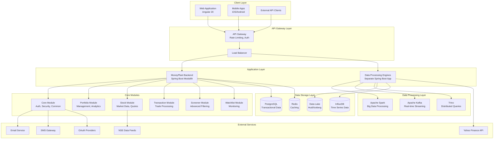
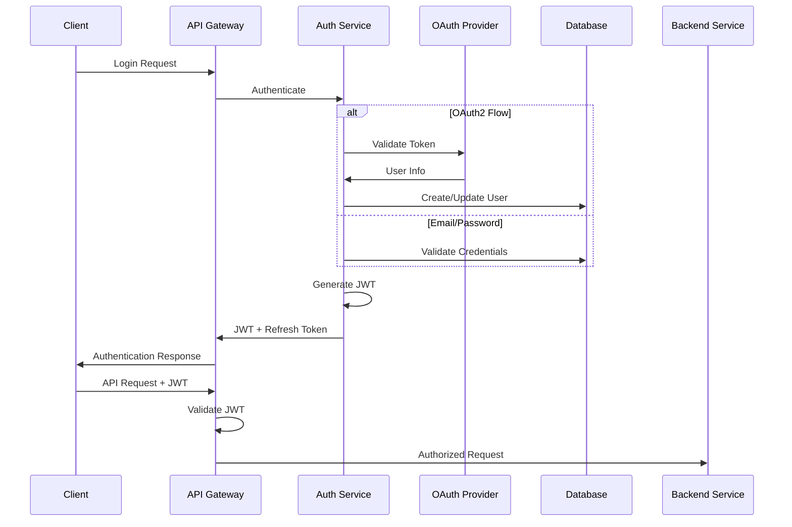

# MoneyPlant Comprehensive Financial Platform - Design Document

## Overview

The MoneyPlant platform is designed as a comprehensive financial portfolio management system using a modular monolithic architecture that can evolve into microservices. The system combines real-time data processing, advanced analytics, and user-friendly interfaces to provide institutional-grade financial management capabilities.

The architecture leverages Spring Boot Modulith for clear module boundaries, Apache Spark for big data processing, and modern web technologies for responsive user experiences. The design emphasizes scalability, security, and maintainability while providing high-performance real-time capabilities.

## Architecture

### System Architecture Overview



### Modular Architecture Design

The system follows Spring Boot Modulith principles with clear module boundaries:

#### Core Module
- **Responsibility**: Authentication, security, common utilities, base entities
- **Key Components**: JWT provider, OAuth2 integration, global exception handling
- **Dependencies**: None (foundation module)

#### Portfolio Module  
- **Responsibility**: Portfolio management, performance analytics, benchmarking
- **Key Components**: Portfolio service, valuation engine, metrics calculator
- **Dependencies**: Core, Stock (for pricing), Transaction (for trade data)

#### Stock Module
- **Responsibility**: Market data management, real-time feeds, historical data
- **Key Components**: Market data service, WebSocket handlers, technical indicators
- **Dependencies**: Core

#### Transaction Module
- **Responsibility**: Trade processing, validation, audit trails
- **Key Components**: Transaction service, validation engine, audit logger
- **Dependencies**: Core, Portfolio (for updates)

#### Screener Module
- **Responsibility**: Advanced stock screening, SQL-based filtering, version control
- **Key Components**: Screener engine, SQL compiler, result processor
- **Dependencies**: Core, Stock (for data)

#### Watchlist Module
- **Responsibility**: User watchlists, monitoring, alerts
- **Key Components**: Watchlist service, alert engine, notification dispatcher
- **Dependencies**: Core, Stock (for pricing)

## Components and Interfaces

### Authentication and Security Components

#### JWT Authentication Service
```java
@Service
public class JwtAuthenticationService {
    // Token generation with 9-hour expiration
    public String generateAccessToken(UserDetails userDetails);
    
    // Refresh token with 24-hour expiration
    public String generateRefreshToken(UserDetails userDetails);
    
    // Automatic token refresh
    public TokenResponse refreshToken(String refreshToken);
    
    // Token validation
    public boolean validateToken(String token);
}
```

#### OAuth2 Integration Service
```java
@Service
public class OAuth2IntegrationService {
    // Google OAuth2 authentication
    public AuthenticationResponse authenticateWithGoogle(String authCode);
    
    // Microsoft OAuth2 authentication
    public AuthenticationResponse authenticateWithMicrosoft(String authCode);
    
    // User profile synchronization
    public void syncUserProfile(OAuth2User oauth2User);
}
```

### Portfolio Management Components

#### Portfolio Service Interface
```java
@Service
public interface PortfolioService {
    // Portfolio CRUD operations
    PortfolioDto createPortfolio(PortfolioCreateRequest request);
    PortfolioDto updatePortfolio(Long id, PortfolioUpdateRequest request);
    List<PortfolioDto> getUserPortfolios(String userId);
    
    // Holdings management
    List<HoldingDto> getPortfolioHoldings(Long portfolioId);
    HoldingDto addHolding(Long portfolioId, HoldingCreateRequest request);
    
    // Performance analytics
    PerformanceMetrics calculatePerformance(Long portfolioId, DateRange range);
    BenchmarkComparison compareToBenchmark(Long portfolioId, String benchmarkId);
}
```

#### Real-time Valuation Engine
```java
@Component
public class ValuationEngine {
    // Real-time portfolio valuation
    @EventListener
    public void onMarketDataUpdate(MarketDataUpdateEvent event);
    
    // Calculate portfolio metrics
    public PortfolioMetrics calculateMetrics(Portfolio portfolio);
    
    // Risk-adjusted returns
    public RiskMetrics calculateRiskMetrics(Portfolio portfolio, DateRange range);
}
```

### Market Data Components

#### Real-time Data Service
```java
@Service
public class RealTimeDataService {
    // WebSocket connection management
    @EventListener
    public void handleWebSocketConnection(WebSocketConnectionEvent event);
    
    // Market data processing
    public void processMarketTick(MarketTick tick);
    
    // Data distribution
    public void broadcastMarketUpdate(MarketUpdate update);
}
```

#### Historical Data Service
```java
@Service
public class HistoricalDataService {
    // High-performance data retrieval using Trino
    public List<OHLCVData> getHistoricalData(String symbol, DateRange range);
    
    // Technical indicator calculations
    public TechnicalIndicators calculateIndicators(String symbol, IndicatorConfig config);
    
    // Data lake integration
    public void storeHistoricalData(List<MarketData> data);
}
```

### Screening Engine Components

#### Screener Execution Engine
```java
@Service
public class ScreenerExecutionEngine {
    // SQL compilation and validation
    public CompiledScreener compileScreener(ScreenerDefinition definition);
    
    // Screener execution
    public ScreenerResults executeScreener(CompiledScreener screener, ParameterSet params);
    
    // Result ranking and scoring
    public RankedResults rankResults(ScreenerResults results);
}
```

#### Version Control Service
```java
@Service
public class ScreenerVersionService {
    // Version management
    public ScreenerVersion createVersion(Long screenerId, VersionCreateRequest request);
    public List<ScreenerVersion> getVersionHistory(Long screenerId);
    
    // Version comparison
    public VersionDiff compareVersions(Long versionId1, Long versionId2);
}
```

### Data Processing Components

#### Backtesting Engine
```java
@Service
public class BacktestingEngine {
    // Strategy backtesting
    public BacktestResults runBacktest(Strategy strategy, BacktestConfig config);
    
    // Performance metrics calculation
    public PerformanceMetrics calculateMetrics(BacktestResults results);
    
    // Parameter optimization
    public OptimizationResults optimizeParameters(Strategy strategy, OptimizationConfig config);
}
```

#### Data Ingestion Service
```java
@Service
public class DataIngestionService {
    // Multi-source data ingestion
    public void ingestFromYahooFinance(List<String> symbols);
    public void ingestFromCSV(InputStream csvData);
    public void ingestFromExcel(InputStream excelData);
    
    // Data validation and quality checks
    public ValidationResults validateData(List<MarketData> data);
    
    // Rate limiting and error handling
    public void processWithRateLimit(DataSource source, RateLimitConfig config);
}
```

## Data Models

### Core Entities

#### User Entity
```java
@Entity
@Table(name = "users")
public class User extends BaseAuditEntity {
    @Id
    private String id;
    
    private String email;
    private String firstName;
    private String lastName;
    
    @Enumerated(EnumType.STRING)
    private AuthProvider authProvider;
    
    private String providerId;
    private boolean emailVerified;
    private boolean active;
    
    @OneToMany(mappedBy = "owner")
    private List<Portfolio> portfolios;
}
```

#### Portfolio Entity
```java
@Entity
@Table(name = "portfolios")
public class Portfolio extends BaseAuditEntity {
    @Id
    @GeneratedValue(strategy = GenerationType.IDENTITY)
    private Long id;
    
    private String name;
    private String description;
    private String currency;
    
    @ManyToOne
    @JoinColumn(name = "owner_id")
    private User owner;
    
    @OneToMany(mappedBy = "portfolio", cascade = CascadeType.ALL)
    private List<PortfolioHolding> holdings;
    
    @OneToMany(mappedBy = "portfolio")
    private List<PortfolioTransaction> transactions;
    
    @OneToMany(mappedBy = "portfolio")
    private List<PortfolioValuationDaily> valuations;
}
```

#### Stock Entity
```java
@Entity
@Table(name = "stocks")
public class Stock extends BaseAuditEntity {
    @Id
    private String symbol;
    
    private String name;
    private String exchange;
    private String sector;
    private String industry;
    
    @Column(name = "market_cap")
    private BigDecimal marketCap;
    
    @Column(name = "current_price")
    private BigDecimal currentPrice;
    
    @Column(name = "last_updated")
    private LocalDateTime lastUpdated;
}
```

### Screening Entities

#### Screener Entity
```java
@Entity
@Table(name = "screeners")
public class Screener extends BaseAuditEntity {
    @Id
    @GeneratedValue(strategy = GenerationType.IDENTITY)
    private Long id;
    
    private String name;
    private String description;
    private boolean isPublic;
    private String defaultUniverse;
    
    @ManyToOne
    @JoinColumn(name = "owner_id")
    private User owner;
    
    @OneToMany(mappedBy = "screener", cascade = CascadeType.ALL)
    private List<ScreenerVersion> versions;
    
    @OneToMany(mappedBy = "screener")
    private List<ScreenerRun> runs;
}
```

#### Screener Version Entity
```java
@Entity
@Table(name = "screener_versions")
public class ScreenerVersion extends BaseAuditEntity {
    @Id
    @GeneratedValue(strategy = GenerationType.IDENTITY)
    private Long id;
    
    private Integer versionNumber;
    private String engine;
    
    @Column(columnDefinition = "TEXT")
    private String compiledSql;
    
    @Column(columnDefinition = "JSONB")
    private String paramsSchemaJson;
    
    @Enumerated(EnumType.STRING)
    private VersionStatus status;
    
    @ManyToOne
    @JoinColumn(name = "screener_id")
    private Screener screener;
}
```

### Transaction Entities

#### Transaction Entity
```java
@Entity
@Table(name = "transactions")
public class Transaction extends BaseAuditEntity {
    @Id
    private String id;
    
    @Enumerated(EnumType.STRING)
    private TransactionType type;
    
    private String symbol;
    private BigDecimal quantity;
    private BigDecimal price;
    private BigDecimal fees;
    
    private LocalDateTime transactionDate;
    
    @Enumerated(EnumType.STRING)
    private TransactionStatus status;
    
    @ManyToOne
    @JoinColumn(name = "portfolio_id")
    private Portfolio portfolio;
    
    @ManyToOne
    @JoinColumn(name = "user_id")
    private User user;
}
```

## Error Handling

### Global Exception Handling Strategy

#### Exception Hierarchy
```java
// Base exception for all business logic errors
public abstract class BusinessException extends RuntimeException {
    private final String errorCode;
    private final Map<String, Object> details;
}

// Specific business exceptions
public class PortfolioNotFoundException extends BusinessException {
    public PortfolioNotFoundException(Long portfolioId) {
        super("PORTFOLIO_NOT_FOUND", Map.of("portfolioId", portfolioId));
    }
}

public class InsufficientFundsException extends BusinessException {
    public InsufficientFundsException(BigDecimal required, BigDecimal available) {
        super("INSUFFICIENT_FUNDS", Map.of("required", required, "available", available));
    }
}
```

#### Global Exception Handler
```java
@RestControllerAdvice
public class GlobalExceptionHandler {
    
    @ExceptionHandler(BusinessException.class)
    public ResponseEntity<ErrorResponse> handleBusinessException(BusinessException ex) {
        ErrorResponse error = ErrorResponse.builder()
            .type("https://api.moneyplant.com/problems/" + ex.getErrorCode().toLowerCase())
            .title(ex.getMessage())
            .status(HttpStatus.BAD_REQUEST.value())
            .detail(ex.getDetails())
            .timestamp(Instant.now())
            .build();
        
        return ResponseEntity.badRequest().body(error);
    }
    
    @ExceptionHandler(ValidationException.class)
    public ResponseEntity<ErrorResponse> handleValidation(ValidationException ex) {
        // RFC-7807 compliant error response
        return ResponseEntity.badRequest().body(createValidationError(ex));
    }
}
```

### Circuit Breaker Pattern
```java
@Component
public class MarketDataService {
    
    @CircuitBreaker(name = "market-data", fallbackMethod = "getCachedMarketData")
    @Retry(name = "market-data")
    @TimeLimiter(name = "market-data")
    public CompletableFuture<MarketData> getMarketData(String symbol) {
        return CompletableFuture.supplyAsync(() -> {
            // External API call
            return marketDataProvider.fetchData(symbol);
        });
    }
    
    public CompletableFuture<MarketData> getCachedMarketData(String symbol, Exception ex) {
        // Fallback to cached data
        return CompletableFuture.completedFuture(cacheService.getCachedData(symbol));
    }
}
```

## Testing Strategy

### Testing Pyramid Approach

#### Unit Tests
- **Coverage Target**: 80% minimum
- **Focus**: Business logic, calculations, validations
- **Tools**: JUnit 5, Mockito, AssertJ
- **Example**:
```java
@ExtendWith(MockitoExtension.class)
class PortfolioServiceTest {
    
    @Mock
    private PortfolioRepository portfolioRepository;
    
    @Mock
    private ValuationEngine valuationEngine;
    
    @InjectMocks
    private PortfolioService portfolioService;
    
    @Test
    void shouldCalculatePortfolioValue() {
        // Given
        Portfolio portfolio = createTestPortfolio();
        when(portfolioRepository.findById(1L)).thenReturn(Optional.of(portfolio));
        when(valuationEngine.calculateValue(portfolio)).thenReturn(BigDecimal.valueOf(100000));
        
        // When
        BigDecimal value = portfolioService.calculatePortfolioValue(1L);
        
        // Then
        assertThat(value).isEqualTo(BigDecimal.valueOf(100000));
    }
}
```

#### Integration Tests
- **Focus**: Module interactions, database operations, external APIs
- **Tools**: Spring Boot Test, Testcontainers, WireMock
- **Example**:
```java
@SpringBootTest
@Testcontainers
class PortfolioIntegrationTest {
    
    @Container
    static PostgreSQLContainer<?> postgres = new PostgreSQLContainer<>("postgres:15")
            .withDatabaseName("moneyplant_test")
            .withUsername("test")
            .withPassword("test");
    
    @Autowired
    private PortfolioService portfolioService;
    
    @Test
    void shouldCreatePortfolioWithHoldings() {
        // Integration test with real database
        PortfolioCreateRequest request = PortfolioCreateRequest.builder()
            .name("Test Portfolio")
            .initialHoldings(List.of(createHoldingRequest("AAPL", 100)))
            .build();
        
        PortfolioDto result = portfolioService.createPortfolio(request);
        
        assertThat(result.getId()).isNotNull();
        assertThat(result.getHoldings()).hasSize(1);
    }
}
```

#### End-to-End Tests
- **Focus**: Complete user workflows, API contracts
- **Tools**: REST Assured, Selenium WebDriver
- **Example**:
```java
@SpringBootTest(webEnvironment = SpringBootTest.WebEnvironment.RANDOM_PORT)
class PortfolioE2ETest {
    
    @Test
    void shouldCompletePortfolioCreationWorkflow() {
        // Authentication
        String token = authenticateUser("test@example.com", "password");
        
        // Create portfolio
        given()
            .header("Authorization", "Bearer " + token)
            .contentType(ContentType.JSON)
            .body(createPortfolioRequest())
        .when()
            .post("/api/v1/portfolio")
        .then()
            .statusCode(201)
            .body("name", equalTo("Test Portfolio"))
            .body("holdings", hasSize(1));
    }
}
```

### Performance Testing
- **Load Testing**: JMeter for API endpoints
- **Stress Testing**: High-volume data processing scenarios
- **Database Performance**: Query optimization and indexing validation

### Security Testing
- **Authentication Testing**: JWT token validation, OAuth2 flows
- **Authorization Testing**: Role-based access control
- **Input Validation**: SQL injection, XSS prevention
- **Penetration Testing**: OWASP Top 10 vulnerability assessment

## Performance Considerations

### Database Optimization

#### Indexing Strategy
```sql
-- Portfolio queries optimization
CREATE INDEX idx_portfolio_owner_id ON portfolios(owner_id);
CREATE INDEX idx_portfolio_created_at ON portfolios(created_at);

-- Transaction queries optimization
CREATE INDEX idx_transaction_portfolio_date ON transactions(portfolio_id, transaction_date);
CREATE INDEX idx_transaction_symbol_date ON transactions(symbol, transaction_date);

-- Market data optimization
CREATE INDEX idx_stock_tick_symbol_timestamp ON stock_ticks(symbol, timestamp);
CREATE INDEX idx_historical_data_symbol_date ON historical_data(symbol, date);
```

#### Connection Pooling
```yaml
spring:
  datasource:
    hikari:
      maximum-pool-size: 20
      minimum-idle: 5
      idle-timeout: 300000
      max-lifetime: 1200000
      connection-timeout: 20000
```

### Caching Strategy

#### Redis Configuration
```java
@Configuration
@EnableCaching
public class CacheConfig {
    
    @Bean
    public CacheManager cacheManager(RedisConnectionFactory connectionFactory) {
        RedisCacheConfiguration config = RedisCacheConfiguration.defaultCacheConfig()
            .entryTtl(Duration.ofMinutes(10))
            .serializeKeysWith(RedisSerializationContext.SerializationPair.fromSerializer(new StringRedisSerializer()))
            .serializeValuesWith(RedisSerializationContext.SerializationPair.fromSerializer(new GenericJackson2JsonRedisSerializer()));
        
        return RedisCacheManager.builder(connectionFactory)
            .cacheDefaults(config)
            .build();
    }
}
```

#### Caching Annotations
```java
@Service
public class StockService {
    
    @Cacheable(value = "stock-prices", key = "#symbol")
    public StockPrice getCurrentPrice(String symbol) {
        return marketDataProvider.fetchCurrentPrice(symbol);
    }
    
    @CacheEvict(value = "stock-prices", key = "#symbol")
    public void evictPriceCache(String symbol) {
        // Cache eviction on price updates
    }
}
```

### Real-time Performance

#### WebSocket Optimization
```java
@Configuration
@EnableWebSocket
public class WebSocketConfig implements WebSocketConfigurer {
    
    @Override
    public void registerWebSocketHandlers(WebSocketHandlerRegistry registry) {
        registry.addHandler(new MarketDataWebSocketHandler(), "/ws/market-data")
            .setAllowedOrigins("*")
            .withSockJS()
            .setHeartbeatTime(25000)
            .setDisconnectDelay(5000);
    }
}
```

#### Async Processing
```java
@Service
public class AsyncPortfolioService {
    
    @Async("portfolioTaskExecutor")
    public CompletableFuture<PortfolioMetrics> calculateMetricsAsync(Long portfolioId) {
        // Async portfolio metrics calculation
        PortfolioMetrics metrics = calculateMetrics(portfolioId);
        return CompletableFuture.completedFuture(metrics);
    }
}
```

## Security Architecture

### Authentication Flow


### Data Encryption
```java
@Configuration
public class EncryptionConfig {
    
    @Bean
    public AESUtil aesUtil() {
        return new AESUtil(environment.getProperty("encryption.key"));
    }
    
    @Bean
    public PasswordEncoder passwordEncoder() {
        return new BCryptPasswordEncoder(12);
    }
}
```

### Audit Logging
```java
@Aspect
@Component
public class AuditAspect {
    
    @Around("@annotation(Auditable)")
    public Object auditMethod(ProceedingJoinPoint joinPoint) throws Throwable {
        AuditLog auditLog = AuditLog.builder()
            .userId(getCurrentUserId())
            .action(joinPoint.getSignature().getName())
            .timestamp(Instant.now())
            .build();
        
        try {
            Object result = joinPoint.proceed();
            auditLog.setStatus("SUCCESS");
            return result;
        } catch (Exception e) {
            auditLog.setStatus("FAILURE");
            auditLog.setErrorMessage(e.getMessage());
            throw e;
        } finally {
            auditLogRepository.save(auditLog);
        }
    }
}
```

This comprehensive design document provides the architectural foundation for implementing the MoneyPlant platform with all the specified requirements. The design emphasizes modularity, scalability, security, and performance while maintaining clean separation of concerns and testability.