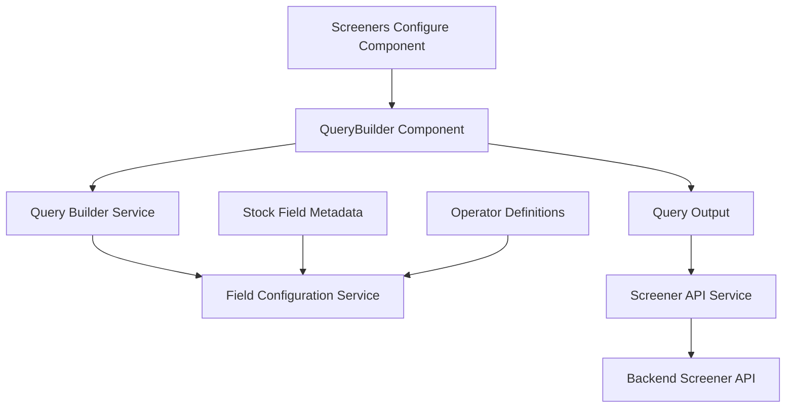

# Design Document

## Overview

This design outlines the creation of a custom QueryBuilder library for the MoneyPlant frontend application. The library will replicate the exact implementation pattern, core logic, and services from the Angular-QueryBuilder project (https://github.com/shout/Angular-QueryBuilder) but using Angular v20 and PrimeNG v20 components only. The UI will be designed to be compact and space-efficient for integration into the existing screeners configuration component.

## Architecture

### Library Structure
The QueryBuilder will be implemented following the exact structure pattern from Angular-QueryBuilder as a standalone Angular library:

```
frontend/projects/querybuilder/
├── src/
│   ├── lib/
│   │   ├── components/
│   │   │   ├── query-builder/
│   │   │   │   ├── query-builder.component.ts
│   │   │   │   ├── query-builder.component.html
│   │   │   │   └── query-builder.component.scss
│   │   │   ├── query-field-details/
│   │   │   ├── query-entity/
│   │   │   ├── query-switch-group/
│   │   │   ├── query-button-group/
│   │   │   ├── query-input/
│   │   │   ├── query-operation/
│   │   │   └── query-remove-button/
│   │   ├── models/
│   │   │   ├── query-builder.models.ts
│   │   │   ├── field.model.ts
│   │   │   ├── option.model.ts
│   │   │   ├── rule.model.ts
│   │   │   └── ruleset.model.ts
│   │   ├── services/
│   │   │   ├── query-builder.service.ts
│   │   │   └── query-builder-config.service.ts
│   │   └── querybuilder.module.ts
│   └── public-api.ts
├── ng-package.json
├── package.json
├── tsconfig.lib.json
├── tsconfig.lib.prod.json
└── tsconfig.spec.json
```

### Integration Architecture
The query builder will integrate with the existing screeners architecture:



## Components and Interfaces

### Core Components (Following Angular-QueryBuilder Pattern)

#### QueryBuilderComponent
- **Purpose**: Main component that renders the query builder interface with compact layout
- **Inputs**: 
  - `config: QueryBuilderConfig` - Field definitions and operators
  - `query: RuleSet` - Initial query state
  - `allowRuleset: boolean` - Enable/disable rule groups
  - `allowEmpty: boolean` - Allow empty rulesets
  - `emptyMessage: string` - Message for empty state
- **Outputs**:
  - `queryChange: EventEmitter<RuleSet>` - Emits query changes
  - `validationChange: EventEmitter<boolean>` - Emits validation state

#### QuerySwitchGroupComponent
- **Purpose**: Renders AND/OR condition switcher for rule groups
- **Inputs**: Current condition, available conditions
- **Outputs**: Condition change events

#### QueryButtonGroupComponent
- **Purpose**: Renders add rule/group buttons with compact spacing
- **Inputs**: Configuration for allowed operations
- **Outputs**: Add rule/group events

#### QueryEntityComponent
- **Purpose**: Renders individual rule or rule group with minimal padding
- **Inputs**: Rule/ruleset data, configuration
- **Outputs**: Rule changes, remove events

#### QueryFieldDetailsComponent
- **Purpose**: Renders field, operator, and value inputs in a compact horizontal layout
- **Inputs**: Available fields, operators, current values
- **Outputs**: Field, operator, value changes

#### QueryOperationComponent
- **Purpose**: Renders operator selection using PrimeNG Select with compact sizing
- **Inputs**: Available operators for field type
- **Outputs**: Operator selection changes

#### QueryInputComponent
- **Purpose**: Renders value input controls with compact sizing based on field type
- **Inputs**: Field type, operator, current value
- **Outputs**: Value changes

#### QueryRemoveButtonComponent
- **Purpose**: Renders remove button with minimal size
- **Inputs**: Confirmation settings
- **Outputs**: Remove events

### Data Models (Exact Angular-QueryBuilder Pattern)

```typescript
export interface QueryBuilderConfig {
  fields: Field[];
  allowEmptyRulesets?: boolean;
  allowRuleset?: boolean;
  getOperators?: (fieldName: string, field: Field) => string[];
  getInputType?: (field: Field, operator: string) => string;
  getOptions?: (field: Field) => Option[];
  addRuleSet?: (parent: RuleSet) => void;
  addRule?: (parent: RuleSet) => void;
  removeRuleSet?: (ruleset: RuleSet, parent: RuleSet) => void;
  removeRule?: (rule: Rule, parent: RuleSet) => void;
}

export interface Field {
  name: string;
  type: string;
  label?: string;
  options?: Option[];
  operators?: string[];
  defaultValue?: any;
  defaultOperator?: string;
  nullable?: boolean;
  entity?: string;
}

export interface Option {
  name: string;
  value: any;
}

export interface RuleSet {
  condition: string;
  rules: Array<Rule | RuleSet>;
}

export interface Rule {
  field: string;
  operator: string;
  value?: any;
  entity?: string;
}

export interface LocalRuleMeta {
  ruleset: boolean;
  invalid: boolean;
}

export const OPERATORS = {
  equal: '=',
  notEqual: '!=',
  lessThan: '<',
  lessThanOrEqual: '<=',
  greaterThan: '>',
  greaterThanOrEqual: '>=',
  in: 'in',
  notIn: 'not in',
  contains: 'contains',
  between: 'between'
};
```

### Service Layer (Following Angular-QueryBuilder Pattern)

#### QueryBuilderService
- **Purpose**: Core service managing query operations and validation (exact Angular-QueryBuilder logic)
- **Methods**:
  - `getOperators(field: Field): string[]` - Get available operators for field
  - `getInputType(field: Field, operator: string): string` - Determine input type
  - `getOptions(field: Field): Option[]` - Get field options
  - `addRule(ruleset: RuleSet, field?: Field): Rule` - Add new rule
  - `addRuleSet(ruleset: RuleSet): RuleSet` - Add new rule group
  - `removeRule(rule: Rule, ruleset: RuleSet): void` - Remove rule
  - `removeRuleSet(ruleset: RuleSet, parent: RuleSet): void` - Remove rule group
  - `validateRuleset(ruleset: RuleSet): boolean` - Validate complete ruleset

#### QueryBuilderConfigService
- **Purpose**: Configuration service for field definitions and operators
- **Methods**:
  - `getStockFields(): Field[]` - Get stock screening field definitions
  - `getDefaultOperators(): string[]` - Get default operator set
  - `getFieldOperators(fieldType: string): string[]` - Get operators for field type

## Data Models

### Stock Screening Field Configuration (Angular-QueryBuilder Format)
The query builder will support the following field types for stock screening:

```typescript
export const STOCK_FIELDS: Field[] = [
  {
    name: 'marketCap',
    type: 'number',
    label: 'Market Cap',
    operators: ['=', '!=', '<', '<=', '>', '>=', 'between'],
    defaultOperator: '>',
    defaultValue: 1000000000
  },
  {
    name: 'pe',
    type: 'number',
    label: 'P/E Ratio',
    operators: ['=', '!=', '<', '<=', '>', '>=', 'between'],
    defaultOperator: '<',
    defaultValue: 20
  },
  {
    name: 'sector',
    type: 'category',
    label: 'Sector',
    operators: ['=', '!=', 'in', 'not in'],
    defaultOperator: '=',
    options: [
      { name: 'Technology', value: 'TECH' },
      { name: 'Healthcare', value: 'HEALTH' },
      { name: 'Financial Services', value: 'FINANCE' },
      { name: 'Consumer Goods', value: 'CONSUMER' },
      { name: 'Energy', value: 'ENERGY' },
      { name: 'Utilities', value: 'UTILITIES' }
    ]
  },
  {
    name: 'dividendYield',
    type: 'number',
    label: 'Dividend Yield (%)',
    operators: ['=', '!=', '<', '<=', '>', '>=', 'between'],
    defaultOperator: '>',
    defaultValue: 2.0
  },
  {
    name: 'priceToBook',
    type: 'number',
    label: 'Price to Book',
    operators: ['=', '!=', '<', '<=', '>', '>=', 'between'],
    defaultOperator: '<',
    defaultValue: 3.0
  },
  {
    name: 'hasEarnings',
    type: 'boolean',
    label: 'Has Earnings',
    operators: ['='],
    defaultOperator: '=',
    defaultValue: true
  }
];
```

## Error Handling

### Validation Strategy
- **Field Validation**: Each field input validates according to its type and constraints
- **Query Validation**: Service validates complete query structure before API submission
- **Error Display**: Inline error messages for invalid inputs, summary for query-level errors

### Error Types
```typescript
export interface QueryValidationError {
  type: 'field' | 'operator' | 'value' | 'structure';
  field?: string;
  message: string;
}
```

## Testing Strategy

### Unit Testing
- **Component Tests**: Test each component in isolation with mock dependencies
- **Service Tests**: Test query validation, conversion, and field configuration logic
- **Model Tests**: Test data model validation and transformation

### Integration Testing
- **Component Integration**: Test query builder component with real field configurations
- **API Integration**: Test query conversion to/from API format
- **Screener Integration**: Test integration with screeners configure component

### Test Configuration
```typescript
// Test setup for Angular v20 compatibility
export const testConfig = {
  imports: [
    CommonModule,
    FormsModule,
    ReactiveFormsModule,
    NoopAnimationsModule
  ],
  providers: [
    QueryBuilderService,
    FieldConfigurationService
  ]
};
```

## Angular v20 Compatibility Updates

### Standalone Components
- Convert all components to standalone components using Angular v20 patterns
- Use `imports` array instead of module declarations
- Implement proper dependency injection with `inject()` function where appropriate

### Signal-Based Reactivity
- Utilize Angular v20 signals for reactive state management
- Implement computed signals for derived state
- Use effect() for side effects

### Control Flow Syntax
- Update templates to use new `@if`, `@for`, `@switch` control flow syntax
- Replace `*ngIf`, `*ngFor`, `*ngSwitch` with new syntax

### TypeScript 5.8 Compatibility
- Update type definitions for TypeScript 5.8 compatibility
- Use latest TypeScript features and strict type checking
- Implement proper generic constraints and utility types

## Integration with Screeners Configure Component

### Component Updates
The `ScreenersConfigureComponent` will be updated to include the query builder:

```typescript
// Add to imports
import { QueryBuilderComponent } from 'querybuilder';

// Add to component
@ViewChild(QueryBuilderComponent) queryBuilder!: QueryBuilderComponent;

// Add properties
queryConfig: QueryBuilderConfig = this.fieldConfigService.getStockFieldConfig();
currentQuery: RuleSet = { condition: 'and', rules: [] };
```

### Template Integration
```html
<div class="criteria-section">
  <h3>Screening Criteria</h3>
  <lib-query-builder
    [config]="queryConfig"
    [query]="currentQuery"
    (queryChange)="onQueryChange($event)"
    (validationChange)="onValidationChange($event)">
  </lib-query-builder>
</div>
```

### Data Flow
1. User interacts with query builder interface
2. Query builder emits changes to parent component
3. Parent component validates and stores query state
4. On save, query is converted to API format and sent to backend
5. On load, API format is converted back to query builder format

## Build Configuration

### Library Build Setup
The library will follow the existing pattern established by the dashboards library:

```json
// ng-package.json
{
  "$schema": "../../node_modules/ng-packagr/ng-package.schema.json",
  "dest": "../../dist/querybuilder",
  "lib": {
    "entryFile": "src/public-api.ts"
  },
  "allowedNonPeerDependencies": []
}
```

### Angular Workspace Integration
Update `angular.json` to include the new library project with build, test, and lint configurations following the established patterns.

### Compact UI Design Strategy
The QueryBuilder will implement a space-efficient design to minimize real estate usage:

#### Layout Principles
- **Horizontal Layout**: Field, operator, and value inputs arranged horizontally in a single row
- **Compact Spacing**: Minimal padding and margins between components (4px-8px)
- **Small Component Sizes**: Use PrimeNG small size variants (`size="small"`)
- **Condensed Typography**: Smaller font sizes for labels and inputs
- **Minimal Borders**: Thin borders and reduced visual weight
- **Inline Actions**: Add/remove buttons positioned inline with rules

#### Component Sizing
```scss
.query-builder {
  --qb-spacing: 4px;
  --qb-input-height: 32px;
  --qb-font-size: 0.875rem;
  --qb-border-width: 1px;
  
  .p-component {
    font-size: var(--qb-font-size);
    
    &.p-inputtext, &.p-dropdown, &.p-inputnumber {
      height: var(--qb-input-height);
      padding: 4px 8px;
    }
    
    &.p-button {
      height: var(--qb-input-height);
      padding: 4px 8px;
      min-width: auto;
    }
  }
}
```

### PrimeNG v20 Component Usage
The QueryBuilder library will exclusively use PrimeNG v20 components with compact sizing:

- **Select Component**: For field and operator dropdowns (`size="small"`)
- **InputText Component**: For text input fields (`size="small"`)
- **InputNumber Component**: For numeric input fields (`size="small"`)
- **Calendar Component**: For date input fields (`size="small"`)
- **Checkbox Component**: For boolean input fields
- **MultiSelect Component**: For multi-value selections (`size="small"`)
- **Button Component**: For add/remove rule buttons (`size="small"`, `severity="secondary"`)
- **Panel Component**: For rule group containers with minimal padding
- **Message Component**: For validation error display (`size="small"`)

### Dependency Management
- Ensure peer dependencies align with main application versions (Angular v20, PrimeNG v20)
- Use only Angular v20 and PrimeNG v20 components - no additional third-party UI libraries
- Minimize external dependencies to reduce bundle size