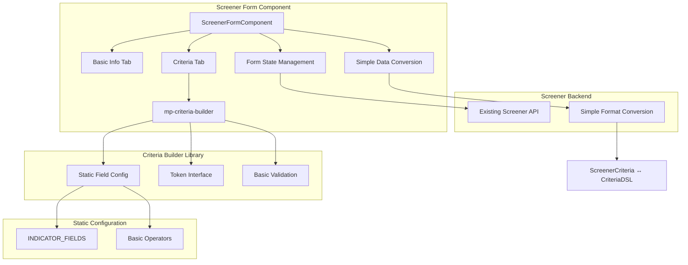
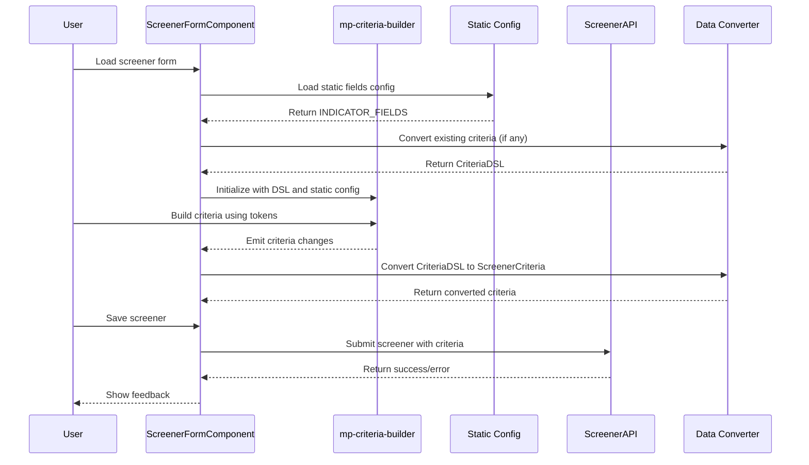

# Design Document - Screener Form Criteria Builder Integration

## Overview

This design document outlines the MVP integration of the existing criteria-builder library into the screener form component, replacing the current query-builder implementation. The design focuses on the bare minimum functionality needed to get the integration working, with a clear path for future enhancements. The approach emphasizes simplicity, static configuration initially, and incremental improvement capability.

## Architecture

### MVP Integration Architecture



### MVP Integration Flow



## Components and Interfaces

### Simplified ScreenerFormComponent

**Purpose:** Main form component with basic criteria builder integration

**Key Changes:**
```typescript
@Component({
  selector: 'app-screener-form',
  standalone: true,
  imports: [
    CommonModule,
    FormsModule,
    ButtonModule,
    CardModule,
    InputTextModule,
    CheckboxModule,
    ToastModule,
    TabsModule,
    AcCriteriaBuilderComponent // Replace QueryBuilderComponent
  ],
  providers: [MessageService],
  templateUrl: './screener-form.component.html',
  styleUrl: './screener-form.component.scss'
})
export class ScreenerFormComponent implements OnInit, OnDestroy {
  private destroy$ = new Subject<void>();
  
  // Existing state management
  screener: ScreenerResp | null = null;
  loading = false;
  error: string | null = null;
  isEdit = false;
  
  // Form data
  screenerForm: ScreenerCreateReq = {
    name: '',
    description: '',
    isPublic: false,
    defaultUniverse: '',
    criteria: undefined
  };

  // Basic criteria builder integration
  activeTab = 'basic';
  criteriaDSL: CriteriaDSL | null = null;
  criteriaConfig: BuilderConfig = {
    allowGrouping: true,
    maxDepth: 3,
    enableAdvancedFunctions: false, // Start simple
    showSqlPreview: false, // Start simple
    compactMode: false
  };
  
  // Static field configuration
  staticFields: FieldMeta[] = [];

  constructor(
    private route: ActivatedRoute,
    private router: Router,
    private screenerState: ScreenerStateService,
    private messageService: MessageService
  ) {}

  ngOnInit() {
    this.initializeSubscriptions();
    this.loadStaticFields();
    this.loadScreener();
  }

  private loadStaticFields() {
    // Convert INDICATOR_FIELDS to FieldMeta format
    this.staticFields = INDICATOR_FIELDS.map(field => ({
      id: field.value,
      label: field.name,
      dbColumn: field.value,
      dataType: field.type as FieldType,
      category: field.category,
      description: field.description
    }));
  }

  // Basic criteria handling
  onCriteriaChange(dsl: CriteriaDSL) {
    this.criteriaDSL = dsl;
    
    // Convert to screener format for backend compatibility
    if (dsl && this.hasValidCriteria(dsl)) {
      this.screenerForm.criteria = this.convertDslToScreenerCriteria(dsl);
    } else {
      this.screenerForm.criteria = undefined;
    }
  }

  private hasValidCriteria(dsl: CriteriaDSL): boolean {
    return dsl && dsl.root && dsl.root.children && dsl.root.children.length > 0;
  }

  hasCriteria(): boolean {
    return this.criteriaDSL ? this.hasValidCriteria(this.criteriaDSL) : false;
  }

  clearCriteria() {
    this.criteriaDSL = null;
    this.screenerForm.criteria = undefined;
  }

  getCriteriaCount(): number {
    if (!this.criteriaDSL || !this.criteriaDSL.root) return 0;
    return this.countConditions(this.criteriaDSL.root);
  }

  private countConditions(group: Group): number {
    return group.children.reduce((count, child) => {
      if ('left' in child) {
        return count + 1; // It's a condition
      } else {
        return count + this.countConditions(child as Group); // It's a nested group
      }
    }, 0);
  }

  // Basic save logic
  saveScreener() {
    if (!this.screenerForm.name.trim()) {
      this.messageService.add({
        severity: 'warn',
        summary: 'Validation Error',
        detail: 'Screener name is required'
      });
      this.activeTab = 'basic';
      return;
    }

    if (this.isEdit && this.screener) {
      this.updateScreener();
    } else {
      this.createScreener();
    }
  }
}
```

### Simple Data Conversion Methods

**Purpose:** Basic conversion between ScreenerCriteria and CriteriaDSL formats (inline methods)

```typescript
// Add these methods directly to ScreenerFormComponent for MVP

/**
 * Convert ScreenerCriteria to CriteriaDSL for criteria builder
 */
private convertScreenerCriteriaToDsl(criteria: ScreenerCriteria): CriteriaDSL {
  if (!criteria) {
    return this.createEmptyDSL();
  }

  try {
    return {
      root: this.convertScreenerGroup(criteria),
      meta: {
        version: 1,
        createdAt: new Date().toISOString(),
        source: 'screener'
      }
    };
  } catch (error) {
    console.error('Failed to convert ScreenerCriteria to DSL:', error);
    return this.createEmptyDSL();
  }
}

/**
 * Convert CriteriaDSL to ScreenerCriteria for backend
 */
private convertDslToScreenerCriteria(dsl: CriteriaDSL): ScreenerCriteria {
  if (!dsl || !dsl.root) {
    return undefined;
  }

  try {
    return this.convertDslGroup(dsl.root);
  } catch (error) {
    console.error('Failed to convert DSL to ScreenerCriteria:', error);
    return undefined;
  }
}

private convertScreenerGroup(criteria: ScreenerCriteria): Group {
  return {
    operator: criteria.condition.toUpperCase() as 'AND' | 'OR',
    children: criteria.rules.map(rule => {
      if ('field' in rule) {
        // It's a ScreenerRule - convert to Condition
        return this.convertScreenerRule(rule as ScreenerRule);
      } else {
        // It's a nested ScreenerCriteria - convert recursively
        return this.convertScreenerGroup(rule as ScreenerCriteria);
      }
    })
  };
}

private convertScreenerRule(rule: ScreenerRule): Condition {
  return {
    left: {
      type: 'field',
      fieldId: rule.field
    },
    op: rule.operator as Operator, // Simple mapping for MVP
    right: {
      type: this.inferValueType(rule.value),
      value: rule.value
    }
  };
}

private convertDslGroup(group: Group): ScreenerCriteria {
  return {
    condition: group.operator.toLowerCase() as 'and' | 'or',
    rules: group.children.map(child => {
      if ('left' in child) {
        // It's a Condition - convert to ScreenerRule
        return this.convertDslCondition(child as Condition);
      } else {
        // It's a nested Group - convert recursively
        return this.convertDslGroup(child as Group);
      }
    }),
    collapsed: false
  };
}

private convertDslCondition(condition: Condition): ScreenerRule {
  return {
    field: (condition.left as FieldRef).fieldId,
    operator: condition.op,
    value: (condition.right as Literal).value,
    entity: 'stock'
  };
}

private inferValueType(value: any): 'string' | 'number' | 'boolean' | 'date' {
  if (typeof value === 'number') return 'number';
  if (typeof value === 'boolean') return 'boolean';
  if (value instanceof Date || /^\d{4}-\d{2}-\d{2}/.test(value)) return 'date';
  return 'string';
}

private createEmptyDSL(): CriteriaDSL {
  return {
    root: {
      operator: 'AND',
      children: []
    },
    meta: {
      version: 1,
      createdAt: new Date().toISOString(),
      source: 'screener'
    }
  };
}
```

### Simple Template Integration

**Purpose:** Basic HTML template with criteria builder integration

```html
<!-- Criteria Tab Panel -->
<p-tabpanel value="criteria">
  <p-card>
    <div class="criteria-header">
      <h3>Screening Criteria</h3>
      <p class="criteria-description">
        Define the technical indicators and conditions that stocks must meet to be included in this screener.
        You can combine multiple conditions using AND/OR logic.
      </p>
    </div>

    <!-- Criteria Builder -->
    <div class="criteria-builder-container">
      <mp-criteria-builder
        [value]="criteriaDSL"
        [config]="criteriaConfig"
        [fields]="staticFields"
        (valueChange)="onCriteriaChange($event)"
        class="screener-criteria-builder">
      </mp-criteria-builder>
    </div>

    <!-- Criteria Actions -->
    <div class="criteria-actions">
      <button 
        pButton 
        label="Clear All Criteria" 
        icon="pi pi-trash" 
        (click)="clearCriteria()" 
        class="p-button-outlined p-button-danger"
        [disabled]="!hasCriteria()"
      ></button>
      <button 
        pButton 
        label="Save Screener" 
        icon="pi pi-check" 
        (click)="saveScreener()" 
        [disabled]="loading"
        [loading]="loading"
      ></button>
    </div>

    <!-- Simple Criteria Preview -->
    <div *ngIf="hasCriteria()" class="criteria-preview">
      <h4>Criteria Preview</h4>
      <div class="criteria-summary">
        <p><strong>Total Rules:</strong> {{ getCriteriaCount() }}</p>
        <p><strong>Logic:</strong> {{ criteriaDSL?.root?.operator || 'AND' }}</p>
        <p><strong>Status:</strong> 
          <span class="status-badge status-active">Active</span>
        </p>
      </div>
    </div>
  </p-card>
</p-tabpanel>
```

## Data Models

### Basic Interface Definitions

```typescript
// Simple field configuration for MVP
export interface StaticFieldConfig {
  id: string;
  label: string;
  dataType: FieldType;
  category?: string;
  description?: string;
}

// Basic operator mapping for MVP
export interface BasicOperatorConfig {
  number: Operator[];
  string: Operator[];
  date: Operator[];
  boolean: Operator[];
}

// Simple conversion result
export interface ConversionResult {
  success: boolean;
  data?: any;
  error?: string;
}
```

### Static Configuration

```typescript
// Basic operator configuration for different field types
export const BASIC_OPERATORS: BasicOperatorConfig = {
  number: ['=', '!=', '>', '>=', '<', '<='],
  string: ['=', '!=', 'contains', 'starts_with', 'ends_with'],
  date: ['=', '!=', '>', '>=', '<', '<='],
  boolean: ['=', '!=']
};

// Field type mapping from INDICATOR_FIELDS
export const FIELD_TYPE_MAPPING: Record<string, FieldType> = {
  'number': 'number',
  'string': 'string',
  'date': 'date',
  'boolean': 'boolean',
  'percent': 'number',
  'currency': 'number'
};
```

## Error Handling

### Basic Error Management

```typescript
// Add these methods directly to ScreenerFormComponent for MVP

private handleCriteriaError(error: any, context: string): void {
  console.error(`Criteria error in ${context}:`, error);
  
  const userMessage = this.getBasicErrorMessage(context);
  this.messageService.add({
    severity: 'error',
    summary: 'Criteria Error',
    detail: userMessage,
    life: 5000
  });
}

private handleConversionError(error: any): void {
  console.error('Data conversion error:', error);
  this.messageService.add({
    severity: 'warn',
    summary: 'Data Conversion',
    detail: 'There was an issue converting criteria data. Using empty criteria.',
    life: 5000
  });
}

private getBasicErrorMessage(context: string): string {
  const contextMessages = {
    'load': 'Failed to load existing criteria. Starting with empty criteria.',
    'save': 'Failed to save screener. Please check your criteria and try again.',
    'convert': 'There was an issue with the criteria format. Please recreate your criteria.'
  };
  
  return contextMessages[context] || 'An unexpected error occurred. Please try again.';
}
```

## Testing Strategy

### Basic Testing Approach

```typescript
describe('ScreenerFormComponent - Basic Criteria Integration', () => {
  let component: ScreenerFormComponent;
  let fixture: ComponentFixture<ScreenerFormComponent>;

  beforeEach(() => {
    TestBed.configureTestingModule({
      imports: [ScreenerFormComponent]
    });

    fixture = TestBed.createComponent(ScreenerFormComponent);
    component = fixture.componentInstance;
  });

  describe('Static Field Loading', () => {
    it('should load static fields on initialization', () => {
      component.ngOnInit();
      
      expect(component.staticFields).toBeDefined();
      expect(component.staticFields.length).toBeGreaterThan(0);
      expect(component.staticFields[0]).toHaveProperty('id');
      expect(component.staticFields[0]).toHaveProperty('label');
    });
  });

  describe('Basic Data Conversion', () => {
    it('should convert criteria DSL to screener format on change', () => {
      const mockDSL: CriteriaDSL = {
        root: {
          operator: 'AND',
          children: [{
            left: { type: 'field', fieldId: 'price' },
            op: '>',
            right: { type: 'number', value: 100 }
          }]
        }
      };

      component.onCriteriaChange(mockDSL);

      expect(component.screenerForm.criteria).toBeDefined();
      expect(component.screenerForm.criteria.condition).toBe('and');
    });

    it('should handle empty criteria gracefully', () => {
      component.onCriteriaChange(null);
      
      expect(component.screenerForm.criteria).toBeUndefined();
      expect(component.hasCriteria()).toBeFalsy();
    });
  });

  describe('Basic Form Integration', () => {
    it('should allow save when name is provided', () => {
      component.screenerForm.name = 'Test Screener';
      
      spyOn(component, 'createScreener');
      
      component.saveScreener();
      
      expect(component.createScreener).toHaveBeenCalled();
    });

    it('should prevent save when name is empty', () => {
      component.screenerForm.name = '';
      
      spyOn(component, 'createScreener');
      
      component.saveScreener();
      
      expect(component.createScreener).not.toHaveBeenCalled();
      expect(component.activeTab).toBe('basic');
    });
  });

  describe('Criteria Count', () => {
    it('should count criteria correctly', () => {
      const mockDSL: CriteriaDSL = {
        root: {
          operator: 'AND',
          children: [
            {
              left: { type: 'field', fieldId: 'price' },
              op: '>',
              right: { type: 'number', value: 100 }
            },
            {
              left: { type: 'field', fieldId: 'volume' },
              op: '<',
              right: { type: 'number', value: 1000 }
            }
          ]
        }
      };

      component.criteriaDSL = mockDSL;
      
      expect(component.getCriteriaCount()).toBe(2);
    });
  });
});
```

This simplified design provides a clear MVP approach that focuses on getting the basic integration working first, with a foundation that can be enhanced incrementally. The architecture is straightforward, uses static configuration initially, and provides clear extension points for future enhancements.