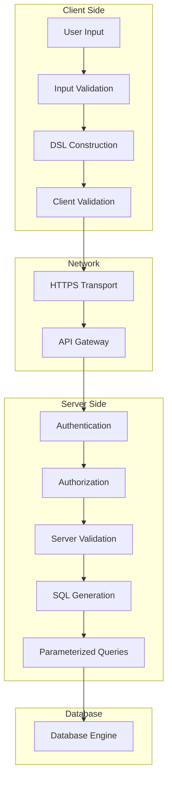

# Security Best Practices - Criteria Builder UI Library

This document outlines security considerations and best practices for using the Criteria Builder UI Library safely in production environments.

## Table of Contents

- [Overview](#overview)
- [SQL Injection Prevention](#sql-injection-prevention)
- [Input Validation and Sanitization](#input-validation-and-sanitization)
- [API Security](#api-security)
- [Import/Export Security](#importexport-security)
- [Client-Side Security](#client-side-security)
- [Backend Security Requirements](#backend-security-requirements)
- [Security Testing](#security-testing)
- [Incident Response](#incident-response)

## Overview

The Criteria Builder UI Library implements multiple layers of security to protect against common web application vulnerabilities. However, security is a shared responsibility between the library and your application implementation.

### Security Architecture



## SQL Injection Prevention

### Server-Side SQL Generation

The library prevents SQL injection through server-side SQL generation:

```typescript
// ✅ SAFE: Server-side SQL generation
const sqlResult = await this.criteriaApiService.generateSql(dsl);
// Returns: { sql: "WHERE price > :p1", parameters: { p1: 100 } }

// ❌ UNSAFE: Never construct SQL on client
// const sql = `WHERE ${field} ${operator} ${value}`; // DON'T DO THIS
```

### Parameterized Queries

All generated SQL uses named parameters:

```sql
-- ✅ SAFE: Parameterized query
WHERE price > :p1 AND volume > :p2

-- ❌ UNSAFE: Direct value injection
-- WHERE price > 100 AND volume > 1000
```

### Field and Function Validation

All field and function references are validated against server-side whitelists:

```typescript
// Backend validation example
@Controller('/api/screeners/criteria')
export class CriteriaController {
  
  @Post('/validate')
  async validateCriteria(@Body() request: { dsl: CriteriaDSL }) {
    // Validate all field IDs against database schema
    const invalidFields = this.validateFieldIds(request.dsl);
    if (invalidFields.length > 0) {
      throw new BadRequestException(`Invalid fields: ${invalidFields.join(', ')}`);
    }
    
    // Validate all function IDs against function registry
    const invalidFunctions = this.validateFunctionIds(request.dsl);
    if (invalidFunctions.length > 0) {
      throw new BadRequestException(`Invalid functions: ${invalidFunctions.join(', ')}`);
    }
    
    return this.criteriaService.validate(request.dsl);
  }
  
  private validateFieldIds(dsl: CriteriaDSL): string[] {
    const fieldIds = this.extractFieldIds(dsl);
    const validFields = this.fieldService.getValidFieldIds();
    return fieldIds.filter(id => !validFields.includes(id));
  }
}
```

## Input Validation and Sanitization

### Client-Side Validation

The library performs client-side validation for user experience:

```typescript
// Input sanitization
export class InputSanitizer {
  static sanitizeFieldId(fieldId: string): string {
    // Only allow alphanumeric characters and underscores
    return fieldId.replace(/[^a-zA-Z0-9_]/g, '');
  }
  
  static sanitizeStringValue(value: string): string {
    // Remove potentially dangerous characters
    return value
      .replace(/[<>]/g, '') // Remove angle brackets
      .replace(/['"]/g, '') // Remove quotes
      .trim()
      .substring(0, 1000); // Limit length
  }
  
  static validateNumericValue(value: any): number | null {
    const num = parseFloat(value);
    if (isNaN(num) || !isFinite(num)) {
      return null;
    }
    return num;
  }
}
```

### Value Type Validation

Strict type validation prevents type confusion attacks:

```typescript
interface ValueValidator {
  validateValue(value: any, expectedType: FieldType): ValidationResult;
}

export class DefaultValueValidator implements ValueValidator {
  validateValue(value: any, expectedType: FieldType): ValidationResult {
    switch (expectedType) {
      case 'number':
        return this.validateNumber(value);
      case 'string':
        return this.validateString(value);
      case 'date':
        return this.validateDate(value);
      default:
        return { isValid: false, error: 'Unknown type' };
    }
  }
  
  private validateNumber(value: any): ValidationResult {
    if (typeof value !== 'number' || isNaN(value) || !isFinite(value)) {
      return { isValid: false, error: 'Invalid number' };
    }
    
    // Check for reasonable bounds
    if (value < -1e15 || value > 1e15) {
      return { isValid: false, error: 'Number out of range' };
    }
    
    return { isValid: true };
  }
}
```

## API Security

### Authentication and Authorization

Implement proper authentication for all API endpoints:

```typescript
// Backend authentication middleware
@Injectable()
export class AuthGuard implements CanActivate {
  canActivate(context: ExecutionContext): boolean {
    const request = context.switchToHttp().getRequest();
    const token = request.headers.authorization?.replace('Bearer ', '');
    
    if (!token) {
      throw new UnauthorizedException('Missing authentication token');
    }
    
    try {
      const payload = this.jwtService.verify(token);
      request.user = payload;
      return true;
    } catch (error) {
      throw new UnauthorizedException('Invalid authentication token');
    }
  }
}

// Apply to criteria endpoints
@Controller('/api/screeners/criteria')
@UseGuards(AuthGuard)
export class CriteriaController {
  // All endpoints require authentication
}
```

### Rate Limiting

Implement rate limiting to prevent abuse:

```typescript
// Rate limiting configuration
@Controller('/api/screeners/criteria')
@UseGuards(ThrottlerGuard)
@Throttle(100, 60) // 100 requests per minute
export class CriteriaController {
  
  @Post('/validate')
  @Throttle(20, 60) // More restrictive for validation
  async validateCriteria(@Body() request: { dsl: CriteriaDSL }) {
    // Validation logic
  }
}
```

### Input Size Limits

Limit request sizes to prevent DoS attacks:

```typescript
// Request size limits
@Controller('/api/screeners/criteria')
export class CriteriaController {
  
  @Post('/validate')
  async validateCriteria(
    @Body(new ParseJsonPipe({ 
      maxSize: 1024 * 1024 // 1MB limit
    })) 
    request: { dsl: CriteriaDSL }
  ) {
    // Validate DSL complexity
    if (this.getDSLComplexity(request.dsl) > 1000) {
      throw new BadRequestException('DSL too complex');
    }
    
    return this.criteriaService.validate(request.dsl);
  }
  
  private getDSLComplexity(dsl: CriteriaDSL): number {
    // Calculate complexity based on conditions, nesting, etc.
    return this.countConditions(dsl) + this.getMaxDepth(dsl) * 10;
  }
}
```

### CORS Configuration

Configure CORS properly for production:

```typescript
// CORS configuration
app.enableCors({
  origin: [
    'https://your-production-domain.com',
    'https://your-staging-domain.com'
  ],
  methods: ['GET', 'POST'],
  allowedHeaders: ['Content-Type', 'Authorization'],
  credentials: true
});
```

## Import/Export Security

### Content Validation

The library includes comprehensive content validation:

```typescript
export class SecurityValidator {
  static validateImportContent(content: string): SecurityValidationResult {
    const threats = [];
    
    // Check for script tags
    if (/<script\b[^<]*(?:(?!<\/script>)<[^<]*)*<\/script>/gi.test(content)) {
      threats.push('Script tags detected');
    }
    
    // Check for JavaScript code patterns
    if (/javascript:|eval\s*\(|Function\s*\(/i.test(content)) {
      threats.push('JavaScript code detected');
    }
    
    // Check for HTML injection
    if (/<[^>]+on\w+\s*=/i.test(content)) {
      threats.push('HTML event handlers detected');
    }
    
    // Check for template injection
    if (/\{\{.*\}\}|\$\{.*\}/g.test(content)) {
      threats.push('Template injection patterns detected');
    }
    
    return {
      isSafe: threats.length === 0,
      threats
    };
  }
}
```

### File Upload Security

Secure file upload handling:

```typescript
export class SecureFileHandler {
  static async validateFile(file: File): Promise<FileValidationResult> {
    // Check file size
    if (file.size > 10 * 1024 * 1024) { // 10MB
      return { isValid: false, error: 'File too large' };
    }
    
    // Check file type
    if (file.type !== 'application/json') {
      return { isValid: false, error: 'Invalid file type' };
    }
    
    // Check file name
    if (!/^[a-zA-Z0-9._-]+\.json$/i.test(file.name)) {
      return { isValid: false, error: 'Invalid file name' };
    }
    
    // Read and validate content
    const content = await this.readFileContent(file);
    const securityResult = SecurityValidator.validateImportContent(content);
    
    if (!securityResult.isSafe) {
      return { 
        isValid: false, 
        error: `Security threats detected: ${securityResult.threats.join(', ')}` 
      };
    }
    
    return { isValid: true };
  }
}
```

### Preset Storage Security

Secure preset storage in localStorage:

```typescript
export class SecurePresetStorage {
  private static readonly STORAGE_KEY = 'criteria_presets';
  private static readonly MAX_PRESETS = 50;
  private static readonly MAX_PRESET_SIZE = 100 * 1024; // 100KB
  
  static savePreset(preset: CriteriaPreset): boolean {
    try {
      // Validate preset size
      const serialized = JSON.stringify(preset);
      if (serialized.length > this.MAX_PRESET_SIZE) {
        throw new Error('Preset too large');
      }
      
      // Validate preset content
      const securityResult = SecurityValidator.validateImportContent(serialized);
      if (!securityResult.isSafe) {
        throw new Error('Preset contains unsafe content');
      }
      
      // Check preset count limit
      const existing = this.getPresets();
      if (existing.length >= this.MAX_PRESETS) {
        throw new Error('Maximum preset count reached');
      }
      
      // Save to localStorage
      existing.push(preset);
      localStorage.setItem(this.STORAGE_KEY, JSON.stringify(existing));
      
      return true;
    } catch (error) {
      console.error('Failed to save preset:', error);
      return false;
    }
  }
}
```

## Client-Side Security

### Content Security Policy

Implement CSP headers to prevent XSS:

```html
<meta http-equiv="Content-Security-Policy" 
      content="default-src 'self'; 
               script-src 'self' 'unsafe-inline'; 
               style-src 'self' 'unsafe-inline'; 
               img-src 'self' data:; 
               connect-src 'self' https://your-api-domain.com;">
```

### XSS Prevention

The library includes XSS prevention measures:

```typescript
export class XSSPrevention {
  static sanitizeDisplayText(text: string): string {
    return text
      .replace(/&/g, '&amp;')
      .replace(/</g, '&lt;')
      .replace(/>/g, '&gt;')
      .replace(/"/g, '&quot;')
      .replace(/'/g, '&#x27;');
  }
  
  static sanitizeAttribute(value: string): string {
    // Remove potentially dangerous characters from HTML attributes
    return value.replace(/[<>"'&]/g, '');
  }
}
```

### Secure Communication

Always use HTTPS in production:

```typescript
// Environment configuration
export const environment = {
  production: true,
  apiUrl: 'https://secure-api.your-domain.com', // Always HTTPS
  enforceHttps: true
};

// HTTP interceptor to enforce HTTPS
@Injectable()
export class HttpsInterceptor implements HttpInterceptor {
  intercept(req: HttpRequest<any>, next: HttpHandler): Observable<HttpEvent<any>> {
    if (environment.production && !req.url.startsWith('https://')) {
      throw new Error('HTTPS required in production');
    }
    
    return next.handle(req);
  }
}
```

## Backend Security Requirements

### Database Security

Implement proper database security:

```sql
-- Create dedicated database user with minimal permissions
CREATE USER 'criteria_app'@'%' IDENTIFIED BY 'strong_password';

-- Grant only necessary permissions
GRANT SELECT ON screeners.fields TO 'criteria_app'@'%';
GRANT SELECT ON screeners.functions TO 'criteria_app'@'%';
GRANT SELECT ON screeners.function_params TO 'criteria_app'@'%';

-- No direct table access for user data
-- All queries go through stored procedures or views
```

### Query Execution Security

Secure query execution:

```typescript
export class SecureQueryExecutor {
  async executeQuery(sql: string, params: Record<string, any>): Promise<any[]> {
    // Validate SQL structure
    if (!this.isValidSQL(sql)) {
      throw new Error('Invalid SQL structure');
    }
    
    // Check for dangerous SQL patterns
    if (this.containsDangerousPatterns(sql)) {
      throw new Error('SQL contains dangerous patterns');
    }
    
    // Execute with timeout
    const timeoutPromise = new Promise((_, reject) => {
      setTimeout(() => reject(new Error('Query timeout')), 30000);
    });
    
    const queryPromise = this.database.query(sql, params);
    
    return Promise.race([queryPromise, timeoutPromise]);
  }
  
  private isValidSQL(sql: string): boolean {
    // Only allow SELECT statements with WHERE clauses
    return /^SELECT\s+.*\s+FROM\s+.*\s+WHERE\s+/i.test(sql.trim());
  }
  
  private containsDangerousPatterns(sql: string): boolean {
    const dangerousPatterns = [
      /DROP\s+/i,
      /DELETE\s+/i,
      /UPDATE\s+/i,
      /INSERT\s+/i,
      /ALTER\s+/i,
      /CREATE\s+/i,
      /EXEC\s+/i,
      /EXECUTE\s+/i,
      /--/,
      /\/\*/,
      /xp_/i,
      /sp_/i
    ];
    
    return dangerousPatterns.some(pattern => pattern.test(sql));
  }
}
```

### Audit Logging

Implement comprehensive audit logging:

```typescript
@Injectable()
export class AuditLogger {
  async logCriteriaValidation(
    userId: string, 
    dsl: CriteriaDSL, 
    result: ValidationResult
  ): Promise<void> {
    await this.auditService.log({
      action: 'CRITERIA_VALIDATION',
      userId,
      timestamp: new Date(),
      details: {
        conditionCount: this.countConditions(dsl),
        complexity: this.calculateComplexity(dsl),
        isValid: result.isValid,
        errorCount: result.errors.length
      },
      ipAddress: this.getCurrentIP(),
      userAgent: this.getCurrentUserAgent()
    });
  }
  
  async logSQLGeneration(
    userId: string, 
    dsl: CriteriaDSL, 
    generatedSQL: string
  ): Promise<void> {
    await this.auditService.log({
      action: 'SQL_GENERATION',
      userId,
      timestamp: new Date(),
      details: {
        sqlLength: generatedSQL.length,
        parameterCount: this.countParameters(generatedSQL),
        dslHash: this.hashDSL(dsl)
      },
      ipAddress: this.getCurrentIP()
    });
  }
}
```

## Security Testing

### Automated Security Tests

Implement automated security tests:

```typescript
describe('Security Tests', () => {
  describe('SQL Injection Prevention', () => {
    it('should reject malicious field IDs', async () => {
      const maliciousDSL: CriteriaDSL = {
        root: {
          operator: 'AND',
          children: [{
            left: { fieldId: "'; DROP TABLE users; --" },
            op: '=',
            right: { type: 'string', value: 'test' }
          }]
        }
      };
      
      const result = await criteriaApiService.validateCriteria(maliciousDSL).toPromise();
      expect(result.isValid).toBe(false);
      expect(result.errors).toContain(jasmine.objectContaining({
        type: 'field_not_found'
      }));
    });
    
    it('should reject malicious function IDs', async () => {
      const maliciousDSL: CriteriaDSL = {
        root: {
          operator: 'AND',
          children: [{
            left: { 
              functionId: "EXEC('malicious code')",
              params: []
            },
            op: '=',
            right: { type: 'string', value: 'test' }
          }]
        }
      };
      
      const result = await criteriaApiService.validateCriteria(maliciousDSL).toPromise();
      expect(result.isValid).toBe(false);
    });
  });
  
  describe('Import Security', () => {
    it('should reject files with script tags', async () => {
      const maliciousJSON = JSON.stringify({
        root: {
          operator: 'AND',
          children: []
        },
        meta: {
          description: '<script>alert("xss")</script>'
        }
      });
      
      const result = importExportService.importFromJson(maliciousJSON, {
        validateContent: true
      });
      
      expect(result.success).toBe(false);
      expect(result.errors).toContain(jasmine.stringMatching(/script/i));
    });
  });
});
```

### Penetration Testing

Regular penetration testing should include:

1. **SQL Injection Testing**
   - Test all field and function ID inputs
   - Test value inputs with SQL injection payloads
   - Test nested function parameters

2. **XSS Testing**
   - Test all text inputs for XSS payloads
   - Test import functionality with malicious content
   - Test preset names and descriptions

3. **CSRF Testing**
   - Verify CSRF protection on all API endpoints
   - Test with forged requests from external sites

4. **Authentication Testing**
   - Test with invalid/expired tokens
   - Test privilege escalation attempts
   - Test session management

### Security Monitoring

Implement security monitoring:

```typescript
@Injectable()
export class SecurityMonitor {
  private suspiciousActivityThreshold = 10;
  private timeWindow = 60000; // 1 minute
  
  async monitorValidationRequests(userId: string, dsl: CriteriaDSL): Promise<void> {
    const recentActivity = await this.getRecentActivity(userId, this.timeWindow);
    
    if (recentActivity.length > this.suspiciousActivityThreshold) {
      await this.flagSuspiciousActivity(userId, 'HIGH_VALIDATION_FREQUENCY');
    }
    
    // Check for suspicious patterns in DSL
    if (this.containsSuspiciousPatterns(dsl)) {
      await this.flagSuspiciousActivity(userId, 'SUSPICIOUS_DSL_PATTERNS');
    }
  }
  
  private containsSuspiciousPatterns(dsl: CriteriaDSL): boolean {
    const dslString = JSON.stringify(dsl);
    
    // Check for SQL injection patterns
    const sqlPatterns = [
      /union\s+select/i,
      /drop\s+table/i,
      /exec\s*\(/i,
      /script\s*>/i
    ];
    
    return sqlPatterns.some(pattern => pattern.test(dslString));
  }
}
```

## Incident Response

### Security Incident Handling

Implement incident response procedures:

```typescript
@Injectable()
export class SecurityIncidentHandler {
  async handleSecurityIncident(
    type: SecurityIncidentType,
    details: any,
    userId?: string
  ): Promise<void> {
    // Log incident
    await this.logIncident(type, details, userId);
    
    // Notify security team
    await this.notifySecurityTeam(type, details);
    
    // Take immediate action based on severity
    switch (type) {
      case SecurityIncidentType.SQL_INJECTION_ATTEMPT:
        await this.blockUser(userId, 'SQL injection attempt');
        break;
        
      case SecurityIncidentType.SUSPICIOUS_IMPORT:
        await this.quarantineImport(details.importId);
        break;
        
      case SecurityIncidentType.RATE_LIMIT_EXCEEDED:
        await this.temporaryBlock(userId, 300000); // 5 minutes
        break;
    }
  }
  
  private async blockUser(userId: string, reason: string): Promise<void> {
    await this.userService.blockUser(userId, reason);
    await this.auditService.log({
      action: 'USER_BLOCKED',
      userId,
      reason,
      timestamp: new Date()
    });
  }
}
```

### Recovery Procedures

Document recovery procedures for security incidents:

1. **Immediate Response**
   - Identify and contain the threat
   - Block malicious users/IPs
   - Preserve evidence for investigation

2. **Assessment**
   - Determine scope of impact
   - Identify compromised data
   - Assess system integrity

3. **Recovery**
   - Restore from clean backups if necessary
   - Update security measures
   - Patch vulnerabilities

4. **Post-Incident**
   - Conduct thorough investigation
   - Update security procedures
   - Implement additional monitoring

## Security Checklist

### Development Checklist

- [ ] All API endpoints require authentication
- [ ] Input validation implemented on client and server
- [ ] SQL injection prevention measures in place
- [ ] XSS prevention implemented
- [ ] CSRF protection enabled
- [ ] Rate limiting configured
- [ ] Audit logging implemented
- [ ] Security tests written and passing
- [ ] Content Security Policy configured
- [ ] HTTPS enforced in production

### Deployment Checklist

- [ ] Security headers configured
- [ ] Database permissions minimized
- [ ] Secrets properly managed
- [ ] Monitoring and alerting configured
- [ ] Backup and recovery procedures tested
- [ ] Incident response plan documented
- [ ] Security scanning completed
- [ ] Penetration testing performed

### Ongoing Security

- [ ] Regular security updates applied
- [ ] Security logs monitored
- [ ] Incident response procedures tested
- [ ] Security training completed
- [ ] Third-party dependencies audited
- [ ] Compliance requirements met

By following these security best practices, you can ensure that the Criteria Builder UI Library is deployed and used safely in your production environment.