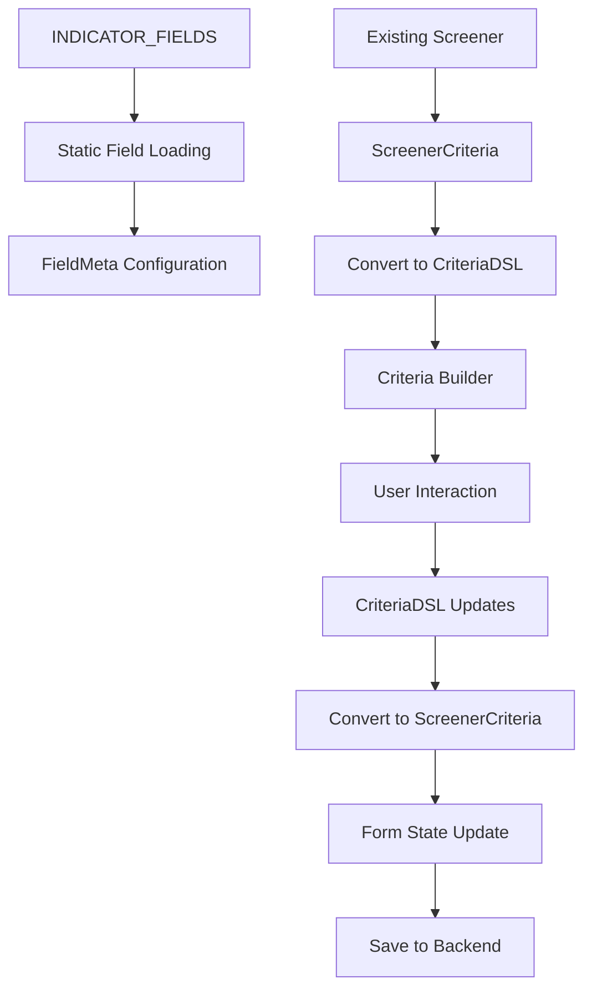

# Screener Form Criteria Builder Integration Documentation

## Overview

This document provides comprehensive documentation for the integration of the criteria-builder library into the screener form component. The integration replaces the previous query-builder implementation with a more flexible and feature-rich criteria building system.

## Integration Architecture

### Component Structure

```
ScreenerFormComponent
├── Static Field Configuration (INDICATOR_FIELDS → FieldMeta)
├── Data Conversion Layer (ScreenerCriteria ↔ CriteriaDSL)
├── Form State Management (Bidirectional sync)
├── Error Handling (User-friendly messages)
└── UI Integration (Tabs, preview, actions)
```

### Data Flow



## Key Components

### 1. Static Field Configuration

The integration uses a static field configuration approach for the MVP implementation:

#### Field Type Mapping
```typescript
const FIELD_TYPE_MAPPING: Record<string, FieldType> = {
  'number': 'number',
  'string': 'string',
  'date': 'date',
  'boolean': 'boolean',
  'percent': 'percent',
  'currency': 'currency'
};
```

#### Operator Configuration
```typescript
const BASIC_OPERATORS: Record<FieldType, Operator[]> = {
  'number': ['=', '!=', '>', '>=', '<', '<=', 'BETWEEN', 'NOT BETWEEN'],
  'string': ['=', '!=', 'LIKE', 'NOT LIKE', 'IN', 'NOT IN'],
  'date': ['=', '!=', '>', '>=', '<', '<=', 'BETWEEN', 'NOT BETWEEN'],
  'boolean': ['=', '!=']
};
```

#### Field Conversion Process
1. **Load INDICATOR_FIELDS**: Source data from existing field definitions
2. **Type Mapping**: Convert field types using FIELD_TYPE_MAPPING
3. **Operator Assignment**: Assign operators based on field type
4. **Validation Setup**: Configure validation rules and constraints
5. **Example Generation**: Create example values for user guidance

### 2. Data Conversion Methods

The integration implements bidirectional data conversion between formats:

#### ScreenerCriteria → CriteriaDSL
```typescript
convertScreenerCriteriaToDsl(criteria: ScreenerCriteria): CriteriaDSL
├── convertScreenerGroup() - Recursive group conversion
├── convertScreenerRule() - Individual rule conversion
└── createEmptyDSL() - Empty state handling
```

#### CriteriaDSL → ScreenerCriteria
```typescript
convertDslToScreenerCriteria(dsl: CriteriaDSL): ScreenerCriteria
├── convertDslGroup() - Recursive group conversion
├── convertDslCondition() - Individual condition conversion
└── inferValueType() - Automatic type detection
```

#### Value Type Inference
The system automatically infers value types for proper data handling:
- **Numbers**: Integers, floats, percentages, currency
- **Strings**: Text, patterns, enums
- **Dates**: Various date formats and ISO strings
- **Booleans**: True/false values and string representations
- **Arrays**: For IN/NOT IN operations

### 3. Form State Management

#### State Synchronization
The component maintains synchronization between two data formats:
- **CriteriaDSL**: Used by the criteria-builder component
- **ScreenerCriteria**: Used by the backend API

#### State Properties
```typescript
// Internal DSL storage
private _criteriaDSL: CriteriaDSL | null = null;

// Form data for backend
screenerForm: ScreenerCreateReq = {
  criteria: undefined // Populated from DSL conversion
};
```

#### Synchronization Methods
- `hasCriteria()`: Checks both formats and resyncs if needed
- `clearCriteria()`: Clears both formats simultaneously
- `onCriteriaChange()`: Converts DSL to screener format on updates

### 4. Error Handling

#### Error Categories
1. **Conversion Errors**: Data format conversion failures
2. **Validation Errors**: Invalid criteria or field configurations
3. **Loading Errors**: Field loading or screener loading failures
4. **Save Errors**: Backend API failures

#### Error Handling Methods
```typescript
handleCriteriaError(error: any, context: string): void
handleConversionError(error: any): void
getBasicErrorMessage(context: string): string
```

#### User Feedback
- **Toast Messages**: User-friendly error notifications
- **Console Logging**: Detailed error information for debugging
- **Fallback Behavior**: Graceful degradation on errors

## Configuration

### Criteria Builder Config
```typescript
criteriaConfig: BuilderConfig = {
  // Basic grouping
  allowGrouping: true,
  maxDepth: 3,
  
  // MVP limitations
  enableAdvancedFunctions: false,
  showSqlPreview: false,
  
  // UI settings
  compactMode: false,
  enablePartialValidation: true,
  autoSave: false,
  debounceMs: 300
};
```

### Field Configuration
Each field is configured with:
- **Basic Properties**: ID, label, database column
- **Type Information**: Data type and allowed operators
- **Validation Rules**: Min/max values, required status
- **UI Metadata**: Category, description, examples

## Usage Examples

### Creating a New Screener with Criteria
1. User navigates to screener creation form
2. Static fields are loaded from INDICATOR_FIELDS
3. User switches to criteria tab
4. Criteria builder initializes with empty DSL
5. User builds criteria using available fields and operators
6. DSL is converted to ScreenerCriteria format on save
7. Screener is created with criteria data

### Editing Existing Screener
1. Existing screener is loaded with ScreenerCriteria
2. ScreenerCriteria is converted to CriteriaDSL format
3. Criteria builder displays existing criteria
4. User modifies criteria as needed
5. Changes are converted back to ScreenerCriteria format
6. Updated screener is saved with modified criteria

### Error Scenarios
1. **Field Loading Failure**: Shows warning, continues with empty fields
2. **Conversion Failure**: Shows error, uses empty criteria as fallback
3. **Save Failure**: Shows error, allows user to retry
4. **Invalid Criteria**: Prevents save, shows validation messages

## Extension Points

### 1. API Integration
Replace static field configuration with dynamic API loading:
```typescript
// Future enhancement
async loadFieldsFromAPI(): Promise<FieldMeta[]> {
  const response = await this.fieldService.getAvailableFields();
  return response.map(field => this.convertApiFieldToFieldMeta(field));
}
```

### 2. Advanced Validation
Implement sophisticated validation rules:
```typescript
// Future enhancement
validateCriteria(dsl: CriteriaDSL): ValidationResult {
  // Complex validation logic
  // Cross-field validation
  // Business rule validation
}
```

### 3. Dynamic Operators
Load operators dynamically based on field metadata:
```typescript
// Future enhancement
getOperatorsForField(fieldId: string): Promise<Operator[]> {
  const field = await this.fieldService.getFieldMetadata(fieldId);
  return this.operatorService.getOperatorsForFieldType(field.type);
}
```

### 4. Criteria Templates
Add support for predefined criteria templates:
```typescript
// Future enhancement
loadCriteriaTemplate(templateId: string): CriteriaDSL {
  // Load and apply predefined criteria template
}
```

### 5. Performance Optimization
Implement caching and optimization strategies:
```typescript
// Future enhancement
@Memoize()
convertDslToScreenerCriteria(dsl: CriteriaDSL): ScreenerCriteria {
  // Cached conversion with memoization
}
```

## Testing Strategy

### Unit Tests
- Field conversion methods
- Data conversion between formats
- Error handling scenarios
- State synchronization logic

### Integration Tests
- Complete screener creation workflow
- Existing screener editing workflow
- Error recovery scenarios
- Form validation integration

### E2E Tests
- User interaction flows
- Cross-browser compatibility
- Performance under load
- Accessibility compliance

## Performance Considerations

### Optimization Strategies
1. **Debounced Updates**: Prevent excessive re-rendering during criteria building
2. **Lazy Loading**: Load field metadata only when needed
3. **Memoization**: Cache conversion results for repeated operations
4. **Virtual Scrolling**: Handle large field lists efficiently

### Memory Management
- Proper subscription cleanup with `destroy$`
- Efficient data structure usage
- Garbage collection friendly patterns

## Security Considerations

### Input Validation
- Sanitize user input in criteria values
- Validate field IDs against allowed fields
- Prevent injection attacks in string values

### Data Protection
- Ensure criteria data doesn't contain sensitive information
- Validate operator usage to prevent unauthorized data access
- Implement proper access controls for field visibility

## Troubleshooting

### Common Issues

#### 1. Criteria Not Loading
**Symptoms**: Existing screener criteria not displayed
**Causes**: Conversion failure, invalid data format
**Solutions**: Check console logs, verify data format, clear and recreate criteria

#### 2. Save Failures
**Symptoms**: Screener save fails with criteria
**Causes**: Invalid criteria format, backend validation failure
**Solutions**: Validate criteria structure, check backend logs, retry with simplified criteria

#### 3. Field Loading Issues
**Symptoms**: No fields available in criteria builder
**Causes**: INDICATOR_FIELDS loading failure, conversion errors
**Solutions**: Check INDICATOR_FIELDS import, verify field format, restart application

#### 4. Performance Issues
**Symptoms**: Slow criteria builder response
**Causes**: Large field count, complex criteria, frequent updates
**Solutions**: Enable debouncing, optimize field loading, simplify criteria structure

### Debug Information

Enable detailed logging by setting:
```typescript
// In development environment
console.log('Criteria conversion debug info:', {
  originalCriteria: screenerCriteria,
  convertedDSL: criteriaDSL,
  fieldCount: this.staticFields.length,
  conditionCount: this.getCriteriaCount()
});
```

## Migration Guide

### From Query Builder
1. Remove query-builder imports and dependencies
2. Add criteria-builder imports
3. Update component template to use `ac-criteria-builder`
4. Implement data conversion methods
5. Update form state management
6. Test existing screener compatibility

### Data Migration
Existing screener data should work without migration as the ScreenerCriteria format is preserved for backend compatibility.

## Future Roadmap

### Phase 1: MVP (Current)
- ✅ Static field configuration
- ✅ Basic data conversion
- ✅ Form integration
- ✅ Error handling

### Phase 2: Enhanced Features
- 🔄 API-driven field loading
- 🔄 Advanced validation
- 🔄 Criteria templates
- 🔄 Performance optimization

### Phase 3: Advanced Capabilities
- 📋 Dynamic operators
- 📋 Field relationships
- 📋 Advanced functions
- 📋 SQL preview and export

### Phase 4: Enterprise Features
- 📋 Criteria sharing and collaboration
- 📋 Version control and history
- 📋 Advanced analytics and insights
- 📋 Custom field definitions

## Support and Maintenance

### Code Ownership
- **Primary**: Frontend Team
- **Secondary**: Platform Team
- **Reviewer**: Technical Lead

### Documentation Updates
This documentation should be updated when:
- New features are added to the integration
- Breaking changes are made to the criteria builder
- Performance optimizations are implemented
- New extension points are identified

### Version Compatibility
- **Criteria Builder**: ^2.0.0
- **Angular**: ^17.0.0
- **PrimeNG**: ^17.0.0

For questions or issues, please contact the Frontend Team or create an issue in the project repository.