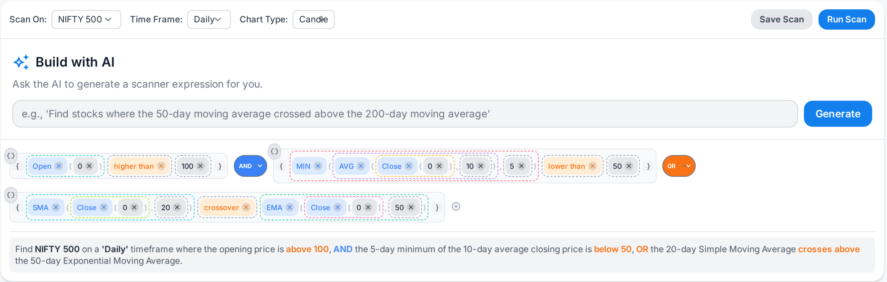

# Feature Specification: Criteria Builder Library

**Feature Branch**: `001-criteria-builder-library`  
**Created**: 2024-12-19  
**Status**: Draft  
**Input**: User description: "create a new specification for a new angular project library called 'criteria-builder' as per the give functionality description - Goal: Create an Angular v20 library (in ./frontend/projects) criteria-builder (ng-packagr ready) that exports a reusable <mp-criteria-builder> component implementing ControlValueAccessor. This component will provide a badge-based visual criteria builder UI for stock screeners, where conditions, groups, functions, operators, parameters, and values are represented as interactive badges. This must be based on the models/entities/dtos and REST API controller endpoints implemented in com.moneyplant.screener package of Java Spring boot project in ./backened"

## Clarifications

### Session 2024-12-19

- Q: What should happen when users exceed maximum nesting depth or element limits? → A: Use 10 levels and 100 maximum elements, I am sure those would be more than sufficient

- Q: How should the criteria builder component handle data fetching and API interactions? → A: Pure input-driven component with no internal API calls - all data passed via @Input properties

## UI Design & Visual Requirements

The criteria builder component should implement a badge-based visual interface as shown in the reference design:

### Visual Design Principles

- **Badge-based Interface**: All criteria elements (fields, operators, values, functions, groups) are represented as interactive badges
- **Hierarchical Layout**: Groups contain nested badges with clear visual hierarchy
- **Interactive Elements**: Each badge includes hover states, delete icons, and editing capabilities
- **Curly-brace Toggle**: Groups display toggleable braces to show/hide enclosure
- **Drag-and-drop Support**: Visual feedback during reordering operations
- **Responsive Design**: Adapts to different container sizes while maintaining usability

### Badge Types Implementation

Based on the reference design, the component should render:

1. **Field Badges**: Display field names (e.g., "Close", "Volume") with appropriate styling
2. **Operator Badges**: Show comparison operators (>, <, =, etc.) and logical operators (AND, OR, NOT)
3. **Value Badges**: Display literal values with type indicators
4. **Function Badges**: Show function calls with parameter badges nested inside
5. **Group Badges**: Contain multiple badges with logical operator indicators and brace toggles
6. **Action Badges**: Include delete icons and editing controls

## User Scenarios & Testing *(mandatory)*

### User Story 1 - Basic Criteria Creation (Priority: P1)

A financial analyst needs to create simple stock screening criteria using field comparisons and basic operators to filter stocks based on price, volume, or other market data.

**Why this priority**: This is the core functionality that enables users to build basic stock screening queries. Without this, the component provides no value.

**Independent Test**: Can be fully tested by creating a simple condition like "Close > 100" and verifying it generates correct DSL output and SQL preview.

**Acceptance Scenarios**:

1. **Given** a user opens the criteria builder, **When** they select a field (e.g., "Close"), **Then** they can choose an operator (e.g., ">") and enter a value (e.g., "100")
2. **Given** a user has created a basic condition, **When** they interact with the component, **Then** the DSL output updates in real-time and shows valid JSON structure
3. **Given** a user has created criteria, **When** they view the SQL preview, **Then** they see parameterized SQL with proper field references

---

### User Story 2 - Grouped Criteria with Logical Operators (Priority: P1)

A portfolio manager needs to create complex screening criteria using AND/OR/NOT groupings to combine multiple conditions for sophisticated stock filtering.

**Why this priority**: Grouping is essential for realistic stock screening scenarios where users need to combine multiple conditions with different logical relationships.

**Independent Test**: Can be fully tested by creating nested groups like "(Close > 100 AND Volume > 1000000) OR (SMA(Close, 20) > EMA(Close, 50))" and verifying proper nesting and operator precedence.

**Acceptance Scenarios**:

1. **Given** a user has created basic conditions, **When** they add a group badge, **Then** they can select AND/OR/NOT operators and drag conditions into the group
2. **Given** a user has created nested groups, **When** they toggle curly braces, **Then** the visual representation updates and SQL generation respects the grouping
3. **Given** a user has complex grouped criteria, **When** they view the DSL output, **Then** the JSON structure properly represents the nested hierarchy

---

### User Story 3 - Function Integration and Parameter Editing (Priority: P2)

A quantitative analyst needs to use technical analysis functions like SMA, EMA, RSI in their screening criteria with proper parameter configuration.

**Why this priority**: Technical analysis functions are crucial for advanced stock screening but secondary to basic field comparisons and grouping.

**Independent Test**: Can be fully tested by creating function calls like "SMA(Close(5), 20) > 50" and verifying parameter validation, nested function support, and correct SQL generation.

**Acceptance Scenarios**:

1. **Given** a user wants to add a function, **When** they select a function badge, **Then** they can configure parameters through inline editing or popup editor
2. **Given** a user has created function calls, **When** they use functions as operands in conditions, **Then** the system validates parameter types and generates correct SQL
3. **Given** a user creates nested functions, **When** they build criteria like "SMA(Close(5), 20) > EMA(Close(5), 50)", **Then** the system handles the nesting correctly

---

### User Story 4 - Interactive Badge Management (Priority: P2)

A user needs to modify, reorder, and delete criteria elements through intuitive badge interactions including drag-and-drop, inline editing, and visual feedback.

**Why this priority**: User experience and interaction design are critical for adoption, but the core functionality must work first.

**Independent Test**: Can be fully tested by creating criteria and then modifying them through badge interactions, verifying all changes are reflected in DSL output.

**Acceptance Scenarios**:

1. **Given** a user has created criteria badges, **When** they hover over badges, **Then** delete icons appear and can be clicked to remove elements
2. **Given** a user has multiple criteria elements, **When** they drag and drop badges, **Then** the order updates and DSL output reflects the new arrangement
3. **Given** a user double-clicks a group badge, **When** they perform the action, **Then** the group collapses/expands with visual indication

---

### User Story 5 - Form Integration and Validation (Priority: P3)

A developer needs to integrate the criteria builder into Angular reactive forms with proper validation, error handling, and accessibility support.

**Why this priority**: Integration capabilities are important for adoption but represent secondary functionality after core criteria building works.

**Independent Test**: Can be fully tested by embedding the component in a reactive form and verifying ControlValueAccessor implementation, validation states, and accessibility features.

**Acceptance Scenarios**:

1. **Given** a developer integrates the component with formControlName, **When** they use it in a reactive form, **Then** the component properly implements ControlValueAccessor interface
2. **Given** a user creates invalid criteria, **When** validation fails, **Then** appropriate error messages are displayed and form validation state updates
3. **Given** a user navigates using keyboard, **When** they tab through the interface, **Then** all interactive elements are accessible and properly focused

---

### Edge Cases

- What happens when a user creates deeply nested groups exceeding the maximum depth limit?
- How does the system handle invalid function parameters or unsupported operator combinations?
- What occurs when a user deletes all criteria elements - does it reset to empty state or maintain structure?
- How does the system handle rapid badge creation/deletion without causing performance issues?
- What happens when field metadata or function definitions change after criteria are created?
- How does the system handle very large criteria structures with hundreds of conditions?

## Requirements *(mandatory)*

### Functional Requirements

- **FR-001**: System MUST provide a reusable Angular component that implements ControlValueAccessor for seamless form integration
- **FR-002**: System MUST render criteria as interactive badges matching the reference design, representing fields, operators, values, functions, and groups with proper visual hierarchy
- **FR-003**: Users MUST be able to create, edit, and delete individual criteria elements through badge interactions
- **FR-004**: System MUST support logical grouping with AND/OR/NOT operators and visual curly-brace toggling
- **FR-005**: System MUST enable drag-and-drop reordering of criteria elements within groups
- **FR-006**: System MUST support technical analysis functions with parameter configuration and nested function calls
- **FR-007**: System MUST generate real-time DSL output in JSON format representing the complete criteria structure
- **FR-008**: System MUST provide SQL preview generation with parameterized queries for database execution
- **FR-009**: System MUST validate criteria structure and provide real-time validity feedback
- **FR-010**: System MUST support keyboard navigation and accessibility features for all interactive elements
- **FR-011**: System MUST be a standalone component that receives ALL data via @Input properties (fields, functions, validation results, SQL preview) with NO internal API calls
- **FR-012**: System MUST provide configurable limits for nesting depth (10 levels) and maximum criteria complexity (100 elements)
- **FR-013**: System MUST emit change events for DSL updates, validity changes, and SQL preview changes
- **FR-014**: System MUST support undo functionality for delete operations with toast notifications
- **FR-015**: System MUST provide both compact and expanded display modes for different use cases
- **FR-016**: System MUST implement visual design consistent with the reference image, including badge styling, spacing, colors, and interactive states

### Key Entities *(include if feature involves data)*

- **CriteriaDSL**: Root data structure containing hierarchical criteria with metadata, representing the complete screening query
- **FieldMeta**: Configuration object defining available fields with data types, allowed operators, and validation rules
- **FunctionMeta**: Configuration object defining available functions with parameters, return types, and SQL templates
- **Group**: Logical container for criteria elements with operator (AND/OR/NOT) and optional enclosure state
- **Condition**: Individual comparison between field/function and value with specific operator
- **FunctionCall**: Executable function with parameterized arguments that can be nested within other functions
- **Literal**: Static value with type information for use in conditions and function parameters

## Success Criteria *(mandatory)*

### Measurable Outcomes

- **SC-001**: Users can create basic field comparison criteria (e.g., "Close > 100") in under 30 seconds
- **SC-002**: System generates DSL output within 100ms of any criteria modification
- **SC-003**: Component handles criteria structures with up to 100 nested elements without performance degradation
- **SC-004**: 95% of users can successfully create grouped criteria with 3+ conditions on first attempt
- **SC-005**: SQL preview generation completes within 200ms for complex criteria with nested functions
- **SC-006**: Component passes accessibility testing with 100% keyboard navigation coverage
- **SC-007**: Form integration works seamlessly with Angular reactive forms in 100% of test scenarios
- **SC-008**: Drag-and-drop operations complete within 150ms with visual feedback
- **SC-009**: Undo functionality restores deleted elements within 500ms of user action
- **SC-010**: Component renders correctly in both compact and expanded modes with proper responsive behavior
- **SC-011**: Visual design matches reference image with 95% accuracy in badge styling, layout, and interactive states

## Assumptions

- Backend screener package provides comprehensive field metadata and function definitions
- Angular v20 and PrimeNG v20 are available in the target environment
- Users have basic understanding of stock screening concepts and logical operators
- Form integration will primarily use Angular reactive forms pattern
- Performance requirements assume modern browsers with adequate memory (4GB+)
- Accessibility requirements follow WCAG 2.1 AA standards
- SQL generation targets standard SQL databases with parameterized query support
- Maximum nesting depth of 10 levels and 100 elements is sufficient for typical use cases
- Badge-based UI paradigm is intuitive for target user base (financial analysts)
- Component is standalone with ALL data provided via @Input properties from parent components
- Parent components handle all API calls using existing frontend services in ./frontend/src/app/services/
- No internal API layer or HTTP calls within the criteria builder component